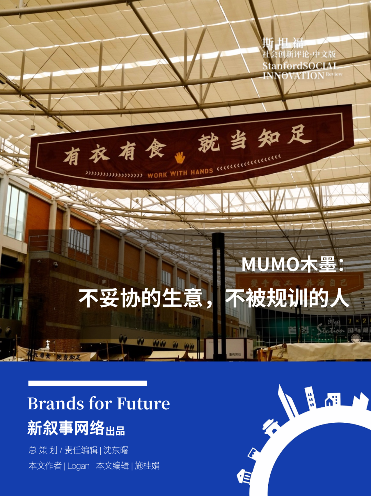
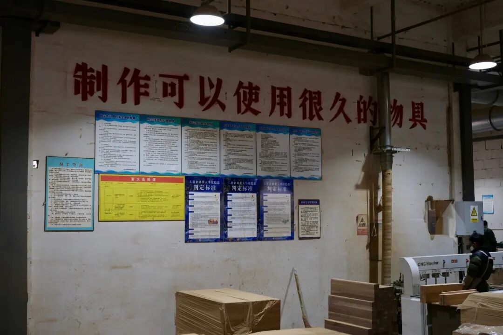
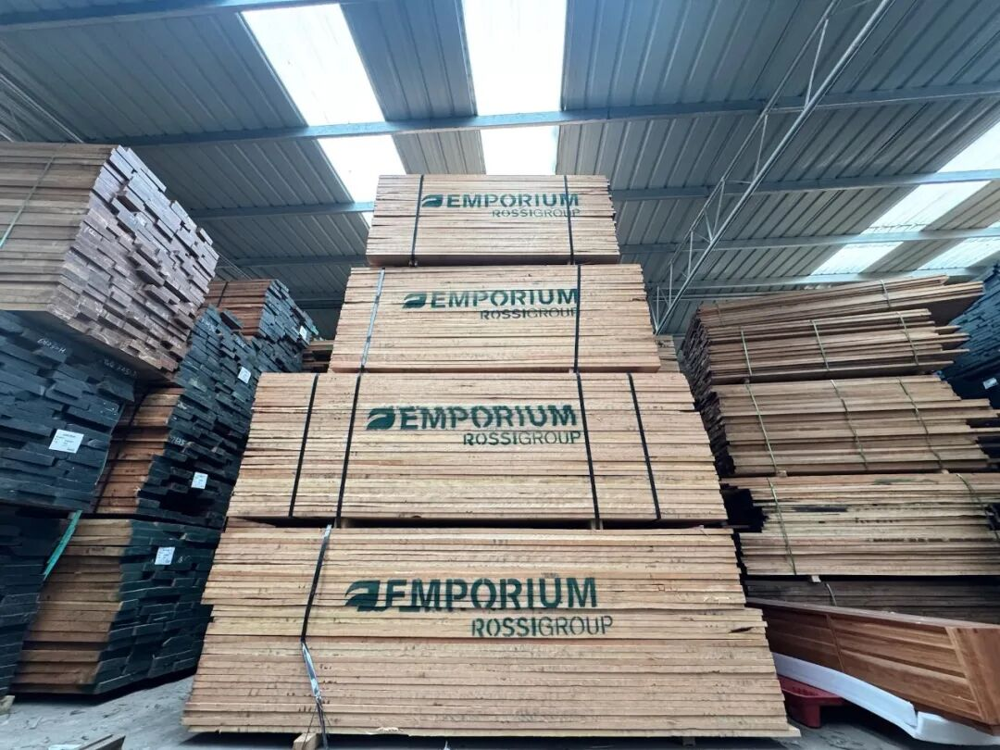
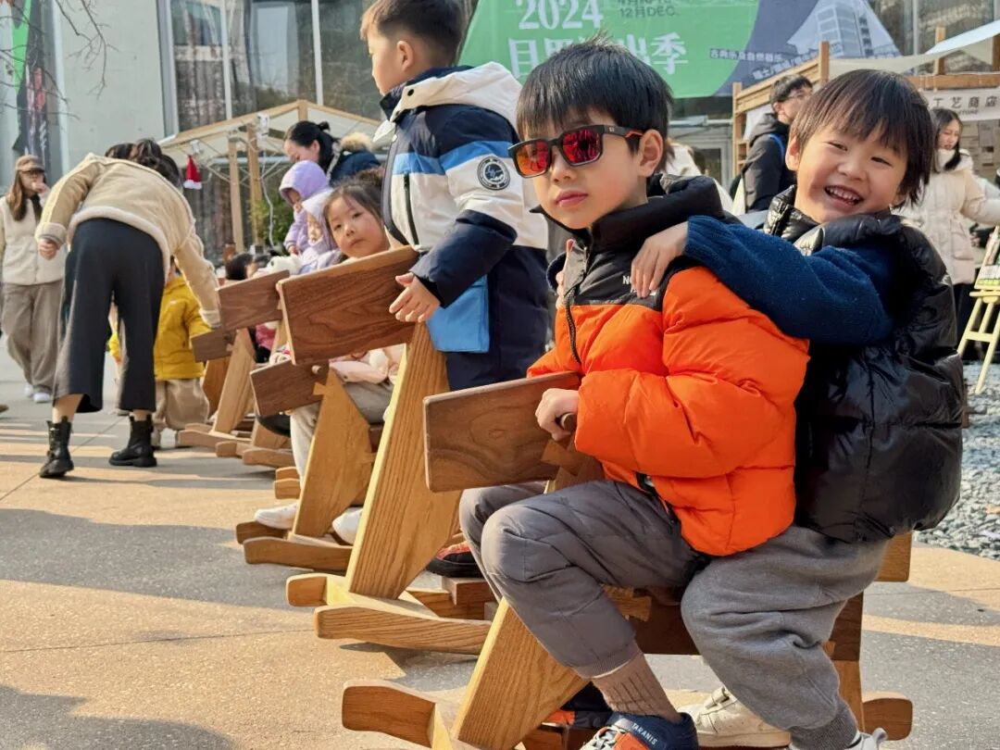
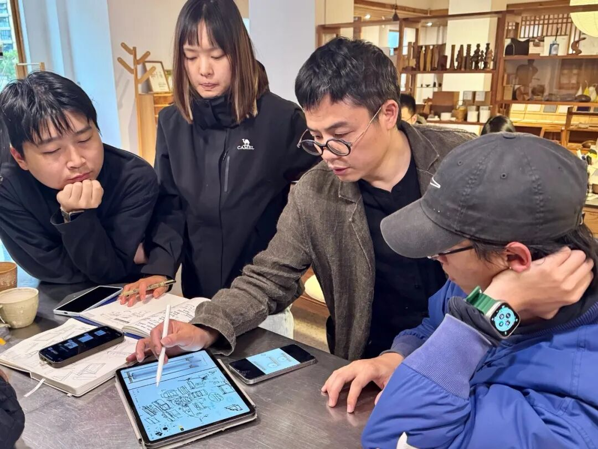
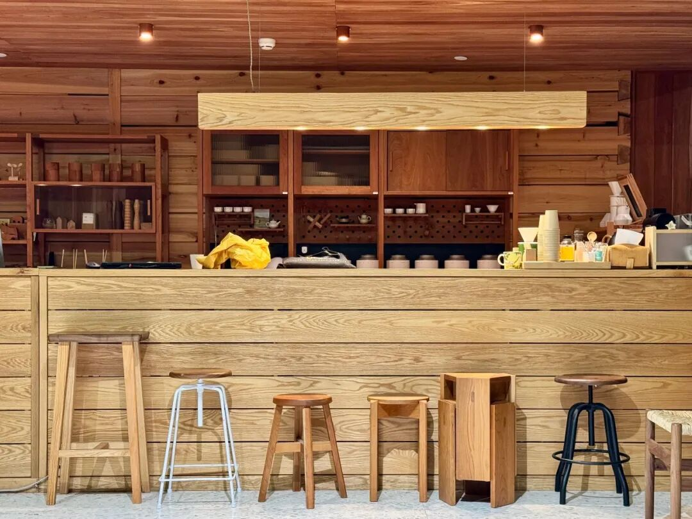

# MUMO木墨：不妥协的生意，不被规训的人

木墨“双手做工”市集，北京朗园 Station，2025 年 5 月

**导读**

    上一周，我们记录了景德镇的[乐天陶社](https://mp.weixin.qq.com/s?__biz=MzU2NTExMjQ4Nw==&mid=2247541949&idx=1&sn=4000450905f34f06142e7374df0b314f&scene=21#wechat_redirect)——一个通过市集、驻场与教育项目慢慢影响城市文化氛围的实践。

而另一种“个性企业”的探索，则发生在一家家具品牌里。MUMO 木墨，这家创立于2011 年的品牌，一度赶上电商时代的高速增长，却始终对“规模”和“流量”保持某种距离：不参与“双11”、设置长期价格保护、在增长与价值观之间不断权衡。与此同时，它也在尝试让一家企业不仅围绕增长运转，而是与劳动、创作和日常生活发生更多连接。

在“共益企业庆祝月” 即将结束之际，我们把视线落在这样一家企业身上——它的故事或许不是关于如何成为一家更大的公司，而是关于：一家企业如何决定自己想成为什么样的企业。

产品会自然呈现它的创造者是一群怎样的人。它会无法掩饰地告诉世界，他们最在意什么，会对什么妥协，有怎样的价值观。苹果的传奇设计师强尼·艾维常用木头橱柜来说明什么是尊重用户的设计——哪怕在无人看见的地方，也用和正面同样好的材料。

木墨是少数在抽屉背板、床支撑板也用北美 FAS 硬木的中国家具品牌之一。它在 2011 年创办，赶上在电商立品牌的最好时候，一度是淘宝上最大的实木家具品牌，现在线下门店开到了 13 个城市。

木墨的产品充分体现创始人李思恩的个人特质。

他有效率和商业直觉。虽然尊重设计，但不偏执于纯手工，而是把原创设计和工厂批量生产有机结合。设计追求线条简单，没什么装饰元素，不随流行而变，一些经典设计已经卖了十多年。效率让木墨比同类设计品牌便宜一截，在地产有活力的年代抓住了一个细分市场快速增长。

木墨并不只追求增长。木墨开的第一间线下店名为“新造”，辟了一块地方，列着各种采购自手工艺人的器物，如陶瓷制品、羊毛毡挂饰、粗布缝制的手提包袋等。在门店里，家具、绿植、精心挑选过的书（以文学、艺术、社科为主）和手工作品搭配摆放，共同营造出自然、安静、品味和秩序。环保和关心用户是另一个特点。每一件家具都袒露木头的原本纹理，不刷漆，只用环保木蜡油。

木墨是品牌，是门店，也是一个社区。差不多每个月，木墨的车队都会从杭州或温州平阳县的仓库出发，去往杭州、顺德、北京等城市，用木屋、木帐篷搭成一个市集，供手工艺者摆摊。有的作品完全实用，比如混合普洱茶粉和云南土猪肉的香肠、现场烘制的面包；有的作品自带表达，比如以回收牛仔布重构而成的“铂金包”；有的回到土地，用尊重自然的方式生产更健康的食物。

这些彼此之间缺少关联的项目最终构成了李思恩向往的生存方式——市集上高高挂起的标语，“双手做工，养活自己”—— 他觉得一个人能通过劳动自己自足，其实就确保了尊严，“你有 100 只羊，他有 10000 只羊。他更多，但你也能养活自己和家人，就不用向人低头。”

经营木墨 15 年，李思恩不仅自己实践着这个生存方式，也试图影响身边的人，从近 400 员工到社区所连接的更多人，也许，还有他的消费者们。

**负责任的木头****会呼吸的家具**

2025 年 3 月下旬的一天，我们来到温州平阳县万全镇的木墨工厂。这里距离木墨在温州瑞安的总部约 30 分钟车程，是上世纪末中国最繁荣的家具出口基地。一路上能看到不少家具品牌的展厅和巨幅广告牌。温州居民依然因为旧时印象开车来买家具，但他们带回的家具其实大多来自广东。

木墨家具厂最不像工厂的地方是气味。鼻子会提醒你，传统家具厂是依赖化学品的生意，站在木墨工厂，吸入鼻腔的是淡淡的坚果味，不会让你想找口罩。这是一个更尊重环境，更尊重在其中工作的人的厂房。

木墨工厂

厂长阿古喜欢带访者去隔壁的家具厂兜一圈，因为不需要说明，区别肉眼可见。在隔壁厂，工作台旁，数卷一米宽的原木薄片像布匹一样卷起，桌上放着几个旧式铁熨斗。工人会在复合板上先刷一层胶，贴上木皮后，再利用熨斗高温将其牢牢粘在家具上。——非常多打着“实木”标签的家具都是这么做出来的。

绝大多数品牌会在家具表面涂油漆或清漆，凝结出一层膜。木头被死死封在一层化学物里，不再与外界接触，更好打理。但这类石化制成品在干燥过程中释放甲苯、二甲苯、甲醛等污染物，需要至少几周通风散味。

木墨没有那么化学的组合。只刷天然材料融合成的木蜡油——由植物油和蜂蜡、棕榈蜡混合而成。慢慢渗入木材的纤维空隙，在表面留有温润、亲肤的触感。木头呼吸水汽的能力也被保留，会跟随温度、湿度发生微妙的变化，像用另一种状态继续活着。

不上漆就不会遮掩木头本身的纹理“瑕疵”，对木头要求更高。符合可再生要求的木头就更少。木墨厂区门口堆放的木板几乎全部来自美国温带阔叶林，是经过了四五十年，甚至超过 80 年的樱桃树、红橡树或黑胡桃树，经过 FSC 环保认证。

木墨工厂储备的进口木板

阿古是木墨最早的用户之一。他之前做设备出口，从没管过家具厂或者任何其他工厂，但对好器物充满兴趣，是实木家具的狂热爱好者。早年他找工厂仿制一张长桌，因此认识了李思恩，被说服买了李思恩自己设计的桌子。上一轮中美贸易战结束了他的贸易工作，让他从木墨的客户变成木墨的厂长。

工厂墙上没什么要求工人撸起袖子的标语，只用红漆印着一句魏碑体的“像做给自己一样，做给他人”。阿古对这份工作的骄傲，有挺大一部分来自这里。

厂房由机器主导。木板被工人从仓库抽出，再推上锯台，随电机转动变成精确的长方体。数控机床上，钻头沿着电脑规划的路线飞过木材表面，在人眼难以捕捉的轨迹中，割出沟槽、打出弧度。

与自动化同时存在的是缓慢。在厂区另一侧，一个工人拿起一片裁好的木板放在工作台的左边，再从一叠同等规格的木板中拿出一片新的，放在旁边仔细比对，他低着头，沉默地观察两片木板的衔接处，确认两侧木纹基本流畅衔接，用记号笔画上一个横向的对勾。没有人想买回一个木纹衔接不规则的大件家具，那不好看。所以，他们专门设置一个岗位，每天就是比对木纹，保证即便是四、五片组成，也几乎让人一眼看不出拼接感。

沿着厂区前行，加工中切下的边角料按不同尺寸堆叠。等待被数控机床切成更小的产品——木勺、砧板、木蛋、木鹅卵石等。自己加工边角料比直接卖给下游（通常被拿去加工成原木木皮）更费力，也更费钱。坚持让团队自己设计，是想表达一项原则上的坚持：不浪费、物尽其用。

**按自己的原则做生意**

木墨工厂所在的家具产业园里，做家具的公司所剩寥寥。上个世纪的出口热潮，如今只剩一丁点遗迹——露天放着的两把欧式扶手椅。实木被雕满适合放进古代宫廷的复杂装饰，表面被涂成厚重的棕色，在阳光下反射出亮光。这两把风格与木墨毫无共性的椅子来自李思恩的父亲，一位很早开始做出口欧式家具的雕花工艺设计师。

李思恩年轻时也没想过走这条路。他学陶艺，毕业后热衷摄影，开了间摄影工作室。装修想省钱，他就自己设计，请了个木工，“瞎指挥”，发现做家具也没那么难。然后又因为帮朋友的设计公司承接了一些家具定制，当作养活自己的副业。30 岁时，家人对他自由随性的生活状态提出额外期待，一种更踏实、更落地的状态，“也是时候收入稳定些、能养家了吧？”摄影工作室倒闭后，李思恩决定创办一个家具品牌，养活自己和家人。

杭州天目里，“双手做工”市集

木马是木墨最早的产品之一，已经卖了超过十年

木墨创业的 2011 年，正值消费升级的热潮，有强烈设计风格和审美的新品牌通常收取溢价，在热络、昂贵的商业地产开店，争夺有钱人。木墨的价格要低一档，以稍高于宜家和无印良品的价格，提供通常在设计品牌才会见到的用料和细节。

为了做到这样的价格，木墨控制伐木之后的整个链条：自己设计、自己生产、自己开店。中国家具业，通常大公司自己建厂降低制造成本，然后批发卖给经销商铺全国；设计品牌则是自己开店控制体验，生产交给外部工厂。而木墨全都自己做，最后家具毛利率只有 30% 多，和很多规模大它十倍以上的公司持平，比主流设计品牌低了快一半——典型的差异化竞争。

木墨诞生在淘宝流量最便宜、最多品牌在线上诞生的年代，又恰好赶上中国房地产销售的最后十年增长，家具最容易卖的十年。但它没有全力抓住商业增长。当“双 11”刚变成一个节日，木墨画了张海报——不参加活动，反对狂欢式购物。

他觉得很多事都有“对的做法”，利润规模不是一切。这关乎于人应该以一种什么样的价值观生活，李思恩自己不喜欢过度消费，不管是价格上还是数量上的过度，更喜欢买好东西，但用很久。

诸多坚持，让木墨成为一个性格鲜明的品牌。

消费环境变差之后，木墨不得不发生一些改变。这两年地产下行、电商内卷，品牌不打折、不打广告就见不到流量。运营团队每到节日打广告、发消息，鼓励顾客消费，也开始参与平台活动。李思恩一方面接受团队在这些事情上努力，另一方面，又偷偷“使绊子”。比如，2019 年 8 月，木墨设置了 18 个月的价格保护机制（墨宝计划），避免团队过度以折扣刺激消费。

李思恩说，这是让品牌“言行一致”。

“言行一致是对木墨重要，还是对你个人重要？”

“对我个人重要。”他说，“不过品牌也就是公司所有个人形成的整体。”

**公司里的大家长**

总部办公区、陶瓷制作区、家具展厅割据木墨瑞安展厅第二层。办工区是最小的，比那更小的是李思恩的办公区——临窗的一张两平米茶桌，由一块不规则完整木头制作。窗台摆满一小盆一小盆的各式多肉植物。办公区随处都散放着李思恩近期阅读的书，从包豪斯、柳宗悦到以赛亚·柏林、《资本主义现实主义》……号称一年 360 天都去办公室的李思恩大部分时间坐在那个桌子旁，手画设计图、开会、看书，但几乎不用电脑（包括在家办公）。

木墨成立头十几年都没有例会。李思恩通常把相关人叫来喝杯咖啡或茶，聊着解决问题。

2025 年起，他开始定期开会。有他参与的会议，时间一到，员工们围着他的茶桌坐成一圈。李思恩守着茶炉不停地烧水、泡茶、给每个人倒茶。如果闭上眼睛听木墨的会议，大部分时候只听到一个人的声音——当然来自于李思恩。

不过听上一会儿，你就会开始困惑：这真的是一个公司例会吗？起初还在聊下一季的锅具设计方案，没过多久，关键词就变成了“设计的骑士精神”“锅的压力原理”“贝聿铭、刘家琨”“现代化与复杂化”“宇宙四向八卦”……

好几个员工说，李思恩说了太多，有时候并不全能理解他最终的意图。于是一个常见的画面是他提了一个问题，没人知道该怎么回答，又怕答错，于是现场完全沉默。

李思恩也不逼问。等上片刻，又像无事发生一样，自己继续滔滔不绝讲起来。

“你觉得员工是不是很怕你？”

“可能还是有代沟吧。”李思恩说。

聊完设计理念和原则，他话锋一转，开始聊到工作的意义。“十几年前，我去杭州约夏丽（如今木墨的联合创始人、首席运营官）和朋友吃饭，得等到晚上十点，夏丽才能从广告公司下班，吃到凌晨一两点。”

“那时候我就由里而外地觉得这样不太对。大家都努力地工作，巨量地工作加班。用时间在换工资。”说到这里，他看向身边围着的一群 20 来岁的“小朋友”，“你们下班了之后时间很多。我不是让你们放松，而是让你们更有效地利用自己的时间。” 工作是好事、是一种美德。但工作不应该把人变成消耗品。木墨每天六点下班，周末双休。

李思恩说话音量一般比较小，音色柔和，更显得苦口婆心。

木墨瑞安展厅，李思恩和木墨的同事讨论设计

除却关心年轻人的价值观这一层，李思恩相信好的设计者不可能只是粗浅地理解生活和人。他也这样要求自己。开始做锅，他自己先把市面上好评的锅具都买回来，一一尝试、比对，再同时读大量跟锅有关的书，研究它物理层面上的原理，琢磨材料。

做一件新事情，以专业标准去理解怎么做好，再去练习。他自己这么做，也总向身边人布道。

李思恩从几年前开始组织员工下班后在瑞安骑行——他认为骑行有益于身心健康。骑行成了一批木墨员工的硬核修行，一行人最远往返骑了约 200 公里。他把自己的两辆竞赛级的自行车放在办公室，如果有谁也想跟同事一起骑行但还没有车，就可以用他的。不适合户外骑车的季节，他们就在家里的骑行台上训练，胸前绑着心率计追踪心脏的跳动区间，踏板连着功率计通过金属形变精确记录每一次蹬下的力量。

做咖啡，他买和 Manner 这样的连锁精品店一样的磨豆机、电子秤。咖啡豆也是买生的，一批一批在几个门店烘焙，员工从早上喝到晚上十点，自然而然地形成了感知力。他们并不负责和咖啡有关的业务，但大家可以通过使用，更好地感受器物的设计、产品温度。

他跟管门店的人说，多去别人的店坐坐，聊一聊。让负责咖啡业务的同事走出手艺人的思维，像创业者一样，想一想战略。跟做产品的同事说多泡泡工厂，看看师傅到底怎么把你的设计作成产品。

木墨杭州天目里展厅二楼的咖啡吧台

家具器具、装修木材均由木墨自己生产

总传递人生哲学的李思恩同时也是个任性的老板。木墨一共也就在 13 个城市开了 19 个线下展厅，南京展厅开了三年，直到现在李思恩从来没去过。零售业的老板，比如泡泡玛特的王宁、名创优品的叶国富，甚至LVMH 的伯纳德·阿尔诺都把每周巡店作为认真刻苦的标签挂身上。

木墨初创期，李思恩也是紧盯一切细节，一个人泡在工厂边看师傅制作边修改自己的设计，自己当淘宝客服，还因此招来了一些同事。一个企业管理者有义务把一项一项事务从模糊变得清晰，再令一些经验可被复用，走上某种商业正轨。但作为个人，李思恩对模式成熟、具有重复性的事物本能地兴致寥寥。所以，巡店的工作他就逃掉了。给出的理由是：自己已经参与了设计，就可以了。

他不做那些能让“创始人”这个人设更有光彩的表演，也抵制名声的诱惑。自从木墨的品牌越来越受认可、市集更受关注，总有人约李思恩参加活动、饭局。他以瑞安太远为由，几乎都拒绝了。

2025 年麓湖社群大会召开，中国最重要的地产公司几乎悉数到场，很多都对木墨感兴趣。他让夏丽代劳。

“你是见人会觉得烦，还是确实不喜欢社交？”

“你要营造到把员工都骗了，让他们觉得你确实是不喜欢社交。”李思恩说。

过了几周，他身边的朋友讲了另一个原因，他担心接触人太多，诱惑太多，需要抵制。

李思恩不喜欢、不擅长，但又需要有人能成熟处理的事，由他陆续拉来几位管理者代劳。夏丽，二十几年的好友，有市场品牌能力，也有温和的个性，能让所有人跟她接触时都觉得被细心关照。郑华威，认识十来年的朋友，像个"大管家"处理公司许多琐碎事宜。何阿姨，年龄算是李思恩长辈，在木墨各个门店之间穿梭，帮店员处理棘手问题，也耐心地教线上客服如何安抚无理取闹的顾客……他们在各自领域承担职责，让几百人的木墨能像一个“正常”商业公司一样运行。

**成为手工艺人的平台**

2025 年五一节假期的最后一天，北京东四环外朗园 Station 园区的“双手做工”市集现场，100 多位手工艺品牌创立者从天南海北来到这里，摊位、设备、物料填满了旧时的火车站。

“双手做工”市集并不突出“木墨”品牌。来市集的人大多并不知道主办方是谁，就算路过“木墨”自己的展台，也未必完全清楚它是干什么的——那里主要放一些木头动物园、木头鹅卵石、木马之类有些乐趣的产品。

但木墨想传达的价值主张以醒目的标语出现在各处：“双手做工，养活自己”“有衣有食，就当知足”“劳动有时，休息有时”“像一棵树，栽在溪水边”。就算顾客不清楚这些标语的来源，文字本身的组合也足够有价值主张。

一个女包摊位吸引了不少人驻足。爱马仕铂金包、Lemaire 牛角包、LV Speedy 层层叠叠，几百元一只，但丝毫没有义乌夜市的拟真感——它们都用牛仔裤做成，多了一些对消费主义的嘲弄。制作者之前在服装公司做设计，年轻人刚入这一行的痛苦都差不多：白 Polo/浅牛仔/帆布鞋，做二十款设计，每款做点不一样的细节。这些只应该给 AI 做的“设计”需求之所以存在，是因为老板并没有什么设计表达，但又得给经销商、消费者玲琅满目的感觉。

木墨“双手做工”市集，北京朗园 Station

（左滑动查看更多）

市集里有类似经历的手艺人不在少数，他们受够了缺少意义的“工作”，通过做工换一种生活方式，但没法负担一个自己的店。市集是他们接触更多消费者的机会。

去年四月在顺德的市集上，有个他很欣赏的陶瓷创作者的销售额排倒数第一，三天只卖了 700 元——同期有的能卖几万元。看到工作群里的销售表格，他托一位同事帮自己买两件作品，再以公司名义采购几件放在门店。

“为什么要这么做？”

“不希望他因为这一次市集受打击，觉得自己的作品没价值。可能这一次他就放弃了。”

如果是别人更早办了“双手做工”市集，年轻的李思恩可能就是这里的摊主之一。他从小厌恶被塑造。初中学数学，有题目怎么也解不出来，老师给了个公式，一下就解出来了。“但公式不是我自己想出来的。我们学数学只是训练熟练度”。离高考越近，熟练度训练越多，他转而学画。

在杭州开陶艺工作室、拍照办摄影展，让他早早认识到艺术是一门怎样的生意：结交关系、兜售自己，“比商人更商人”。他向往保罗所描述的生存方式——“这双手常常供给我和与我在一起的人所需用的。”

做家具，创办木墨，李思恩第一次实现了“双手做工，养活自己”，然后就开始想着怎么影响更多人。

成立三年，他认为公司已经有能力帮助更多创作者。在杭州东信和创园开第一个线下展厅，木墨辟了一片地方给，取名“新造”，卖自己挑选来的手工艺者的作品。为了减少商业气息，当时店里的工艺品都没有价格标签。

新造社区一直不温不火。人们买家具的理由是固定的，但逛手工艺品店不是特别确定的需求。木墨的产品风格统一，而新造社区里的物件气质各异。社区集合店的形态注定了李思恩不能像管木墨一样控制一切。

进展更多来自市集。新冠疫情封控期间，很多市集被迫停下，但有家具收入的木墨在厦门开办了第一场“双手做工”市集，从全国召集了 100 多个手工艺品牌，当中有一些就来自新造社区。在当地的一个影视园区，原木条和麻布搭起的小摊位沿泳池排开。

到了 2022 年，街道、片区、乃至一个城市和它的周边道路，一会儿凝固一会儿打开。商业不再延续，一些办了很多年的市集就此终结。但“双手做工”市集还是一场一场办，摊主跟着木墨的车队去了一个又一个新城市。

很少有不断流动去其他城市搭建的市集，这么做成本太高，“双手做工”市集前十几次，基本次次赔钱，靠木墨主业养活。但也因此，它更能保持新鲜感：每月从全国召集手工艺者，再以快闪形式入驻一个城市，下个月再换地方，消费者不会快速疲惫。

稳定的品牌和口碑逐渐形成。越来越多有名气的商业地产专门邀请木墨来办市集。在北京木墨展厅，夏丽一波又一波地带有意合作的品牌方去市集现场看看；前一天他们受北京檀谷邀请去门头沟讨论合作可能，刚回到展厅没多久，就有天津、北京宋庄的活动策展人来拜访。

市集只是勉强自负盈亏。“新造”作为一个正式业务做了三年，开了几家店，也亏了两年。李思恩给“新造”的财务底线是别把主品牌的利润全亏光。我问为什么亏钱也得做，他说，“如果我能做，又不去做，也是一种遗憾。”

无人料想的是，木墨这些不务正业的尝试可能帮它找到了家具以外的可能性。

**从家具品牌到生活方式品牌**

2025 年 3 月，木墨经历了一次生存危机。中美贸易冲突，关税加到近 100%。中国公司必须从美国进口的商品种类不多，木墨需要的木材恰好是其中之一。对于 30% 多毛利率的公司，增加 10% 成本也是沉重负担。

木墨试了换材料，用俄罗斯运来的水曲柳做了张桌子。当工厂刷完木蜡油，晾干，拍照发到群里，大家都沉默了，照片里的桌板色差大到没有消费者能接受。

树木满地球都是，但采伐后如果烘干措施不当、含水量控制不好，浸入木蜡油就会导致变色。全球林木业生产标准化的地区也就北美、西欧、日本。加拿大木材产量在全球仅次于美国，但因为地处寒带、温度低、光照少，很少生长能做高端家具的硬木。欧洲、日本农林业生产效率低于美国，木材价格贵很多。

家具本来也不是什么朝阳产业——消费者不换房子，生意可想而知。电商平台也内卷到了前所未有的程度。在淘宝上，模仿木墨已经成了家具店引流的招数，至少几十个品牌以类似的关键词销售实木家具，有店直接取名“木墨 MUMO”“中国木墨总店”，竟也能正常经营很长时间。

最绝望的时候，也有同事向李思恩提过更简单的解决办法——给家具上漆，能选的木头更多，成本能降不少。

李思恩直接回绝。他把底线划在了这里。为增长妥协，木墨不一定竞争得过做便宜产品的对手，但这个品牌就彻底放弃了自己的价值观。“大不了再缩回去”。即便回到十年前的规模，至少自己还是自己。

与此同时，木墨总部的员工看到了老板的新爱好，做饭。之前如果没什么特别的事，李思恩每天三餐都走到街对面，和一家人一起吃饭——但日常都是太太做饭。

李思恩回到了创办木墨时的状态，自己亲手实践，打磨产品，希望让木墨卖消费频率更高的家居用品，比如锅和灯。

他在 4 月买了四口锅，炖鸡、煎老豆腐，用四口不同的锅做同样的菜，分给同事，去理解不同材料、制作方法带来的体验差异。去年五一节，新的锅送到北京门店，很快卖了两只，这几百元比市集几十万元的门票更让这位创业者高兴。这证明从以木头为主体，像陶瓷延伸的尝试有机会，这也意味着，这个以木为始的家具品牌将向生活方式品牌转型。

更成熟一些的是陶瓷灯具。用白瓷做成锥形、树形的灯罩，安上木头底座，内置电池，以最通用的 USB-C 口充电，方便拿到家里各处使用。光线透过白瓷，有一种其他材料无法取代的柔和感。

得益于新造社区、“双手做工”市集，以及木墨线下、线上门店多年带着卖家居生活用品和手工艺品，用户已经多少接受这也是个生活家居品牌。新业务正逐渐填补家具销售下滑造成的缺口。

2025 年 11 月，木墨宣布因关税和选材成本上涨 20%，部分家具平均调价 6%-7%。涨价必然带来销售下滑，但这是李思恩更愿意做的选择。坚持品质，就是还在做自己。

做自己对他非常重要。经营木墨十几年，对李思恩而言是同事给自己创造一种生存方式：自食其力，不被社会规训。

最早他为自己，现在为更多人。

除特别说明外，本文图片均由作者拍摄。

|  |  |
| --- | --- |
| **01** | ●**乐天陶社：一个社区改变一座城，又重新适应它** |
| [► 点击阅读](https://mp.weixin.qq.com/s?__biz=MzU2NTExMjQ4Nw==&mid=2247541949&idx=1&sn=4000450905f34f06142e7374df0b314f&scene=21#wechat_redirect) |

|  |  |
| --- | --- |
| **02** | ●**Arch：一个蜂鸟般的外贸公司，如何参与并推动可持续服装变革** |
| [► 点击阅读](https://mp.weixin.qq.com/s?__biz=MzU2NTExMjQ4Nw==&mid=2247533724&idx=1&sn=510dad22344d93b4d4353c606f04318c&scene=21#wechat_redirect) |

|  |  |
| --- | --- |
| **03** | ●**Luneurs：另类成长** |
| [► 点击阅读](https://mp.weixin.qq.com/s?__biz=MzU2NTExMjQ4Nw==&mid=2247532609&idx=1&sn=5ff5e8775adafda0bf25eb6d23d361df&scene=21#wechat_redirect) |

