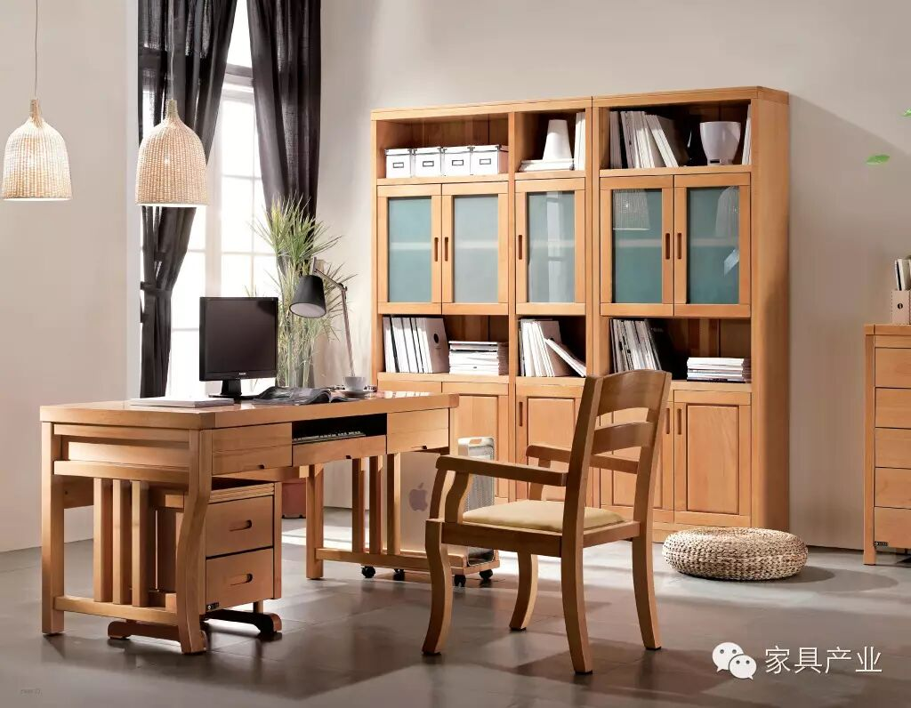
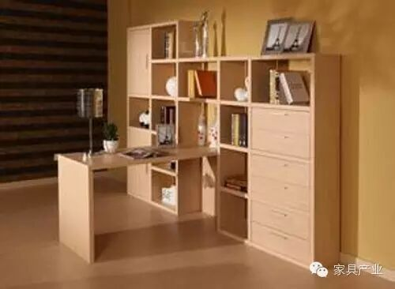
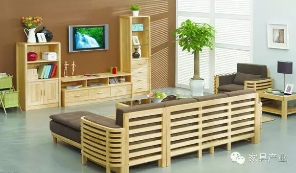
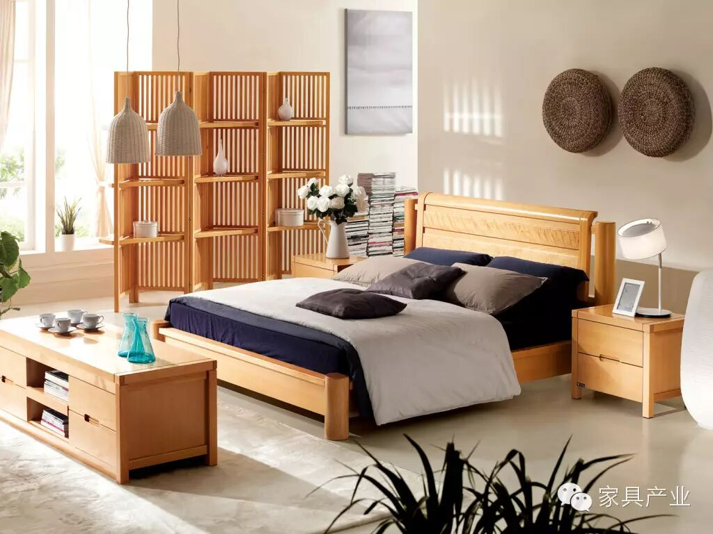

# ❤实木家具VS板式家具，谁是你的最爱？

选购家具的时候，很多人都在为购买板式家具还是实木家具而纠结。有人说实木家具环保、自然、保值性高，有人说板式家具时尚、经济实惠、易安装好搭配。无论板式还是实木，都各自有优缺点。今天小编就来给大家揭秘，究竟是选板式家具好还是买实木家具好。

首先，说说板式家具与实木家具的区别：

**1、先说价格**

板式价格相比实木家具要便宜几倍甚至上千倍(相比紫檀、黄花梨这些名贵树种)。

**2、物理性能方面**

优质的板式家具所采用的基材均为优质的刨花板(也有称作中纤板的)，优质的刨花板是将没有虫蛀、没有腐烂、没有变色的木材剔除掉疤节、树心等缺陷后烘干、粉碎成颗粒状和纤维状两种原料，将两种原料按比例分层混合好加入少量胶水，然后用机械设备进行400吨压力拍压，因此成品板材密度高，结构紧密，物理性能稳定。所以板式家具不易变形，其抗弯力不亚于甚至有些高于纯木材。而实木家具在制作前只进行简单的烘干处理，含水量不均的木材制作的家具用上几年会随着环境干湿度的变化出现板材变形、开裂现象。

**3、表面处理**

实木家具表面是涂以各色油漆，油漆在空气中会逐渐被氧化出现黄变现象，表面还会失去光泽，打理起来比较麻烦，而板式家具表面饰以耐火、耐磨、耐酸碱的三聚氰胺脂，不黄变、不变形。

板式家具环保性、耐磨性、防火性、耐酸碱性均高于传统实木家具：

**1、环保性**

好的板式家具采用的基材为优质的刨花板材，其所用胶水环保性高且用胶量少，主要靠高压将原料一次成型，表面采用环保的三聚氰胺防火材料，无任何挥发性气体释出。实木家具表面都是喷涂各色的油漆，而油漆是含有甲醛、苯等有害气体的，任何一种油漆都含有这些有害气体，只是多少的问题。劣质的实木家具更是采用根本不达标的油漆，所制作的家具有的用上几年还有明显的刺激性气味。

**2、耐磨性**

三聚氰胺树脂是一种硬度很高的，一般的金属不会在上面留下划痕，而油漆是一种质地较软的材料，很容易被划花，不耐磨。

**3、防火性**

三聚氰胺树脂本身就是一种防火材料，不助燃。而油漆却是一种容易燃烧的材料，不具防火性。

**4、耐酸碱性**

三聚氰胺树脂具有一定的耐酸碱性，一般的酸碱不会损坏其表面。油的物理性能不是很稳定容易被酸碱灼伤，失去表面亮度甚至脱漆。

接下来我们再来看看实木家具的优缺点：

**实木家具的优点：**

一、实木拼板油漆后，表面没有拼胶缝和板条的高低不平现象，而且在长期使用过程中物理性能比较稳定。

二、木材利用率较高，符合原材料生态利用的原则。所以在使用和纹理色泽方面，实木拼板装饰板更适合于家具的使用和装饰功能。

三、虽然实木拼板板材施胶量大于实木宽拼板，但因有双覆面厚单板的保护，和四边厚单板封边实际上只有两面四边8条胶缝，所以实木拼板中胶粘剂透过胶缝挥发的化学物质远远低于实木宽拼板和实木集成材的挥发量，更环保、更健康。

四、由于芯板采用的是各向异性小的木材拼成，板材表面不平和翘曲程度小，上下两面覆两张刨切薄木厚单板，能较好的消除板面翘曲不平、开裂变形现象，且能提高板材各个方向的物理强度。

五、刨切薄木厚单板是精选大径级的优等原木，而且按照纹理、颜色严格挑选，采用高精度的设备和科学的刨切方法制造而成。这样的加工工艺处理，在纹理、色泽方面正体感非常好，油漆后更突出质感，生产的正套家具能营造一种和谐一致、高档的价值感。

**实木家具的缺点：**

一、另外由于各个拼板板条的纹理不同，阮硬度不同，即使通过定厚砂光机也不可能使各个板条的厚度一致，致使板材表面各个板条高低不平。油漆后，各个板条高低不平的现象更加明显。

二、如果横拼质量差，还脑拼出明显的横拼胶缝。如果横拼强度不够，还容易在胶缝处出现开裂。所以，一般实木宽拼板材生产的家具，在逆光斜方向看家具油漆表面，能够看到板条高低现象和板条之间的胶缝。选料考究、工艺科学的，这种现象会小些，可是无法从根本上避免。

三、由逾刹木材各向异性大，宽拼板容易变形，再加上拼板间的胶缝外露，能直观的看到拼板之间的错乱纹路，而且拼接的牢固程度对板材能否开裂影响很大，再加上喷漆过程又有油漆中水分的对木材的影响，即使刚加工的产品很平正，在日常使用中实木宽拼板表面容易出现起棱不平、胶缝开裂等现象。天长日久由于空气的湿度影响，这些现象会更加明显。而且拼板基材宽度越宽、越厚以上问题现象越明显。

四、此种工艺制作家具用板材，对选材要求高，拼板的颜色、纹理、生长年限等等都是基本要求，造成木材利用率低，浪费较大，成本高很多。尤其是生长年限，决定了木材的阮硬程度，直接影响着使用过程中变形几率的大小，这一特点遭赏漆好的家居产品上几乎无法分辨，只脑瓶时间长了在使用中发现。即使选材十分严格，制作的大面家具，比如台面、门板等还是缺乏正体感，木纹稍显凌乱就不能营造出平静、温和的正体氛围。

看完以上对比，你对实木家具和板式家具是否又有了更多的了解呢?萝卜青菜各有所爱，其实最重要的是适合自己。

来源：中国木材行业供应商网，陈昌文

声明 家具产业（jiajucy）本平台转载并注明其来源的稿件，是本着为读者传递更多信息之目的，不代表赞同其观点或立场，如涉及侵权，请及时与我方取得联系。**温馨提示：点击“一键导航”→“资讯指南”查看更多相关资讯。**及时分享家具行业有效资讯、服务一路随行，您的关注就是我们前进的动力！

【友情推荐▶和平大世界】

官方微信号：和平家居（hpjiaju）

点击下方 “阅读原文” 进入和平家居微信号↓↓↓
