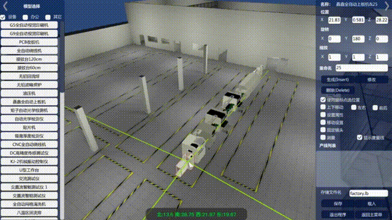
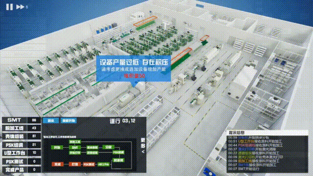
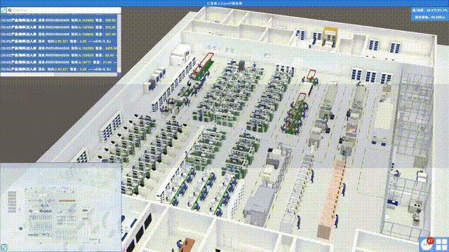
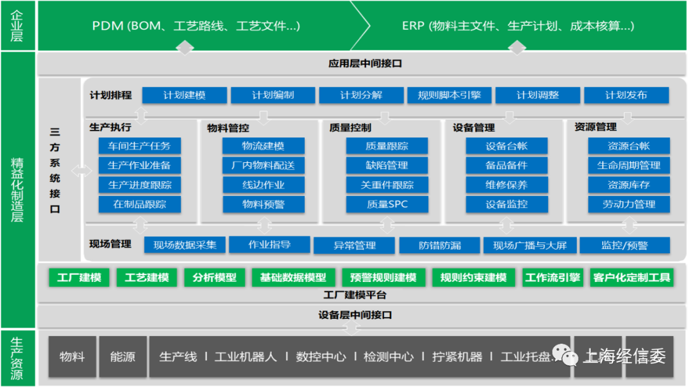
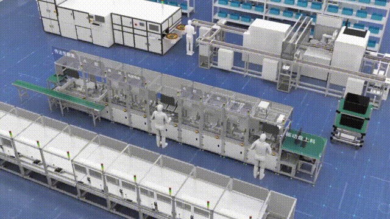
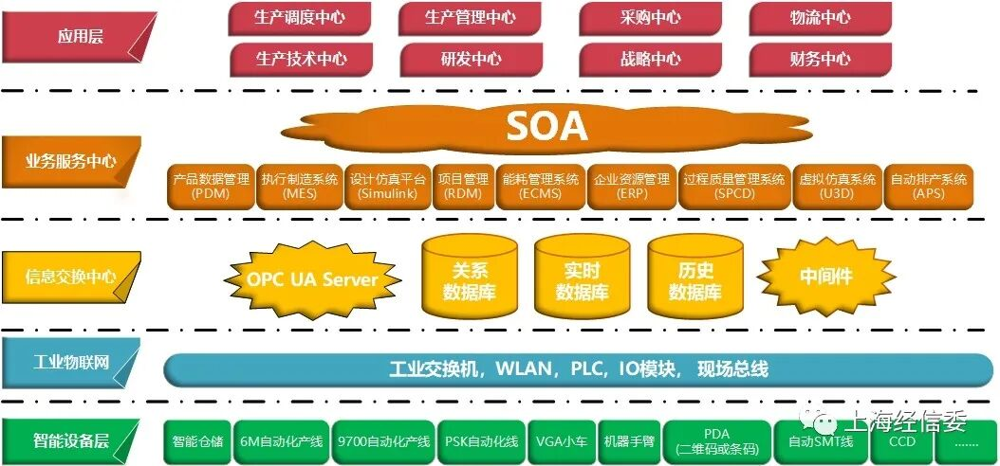
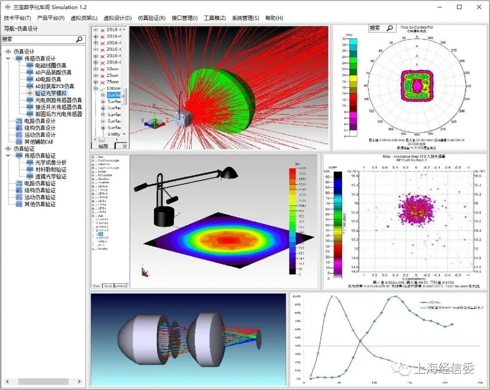
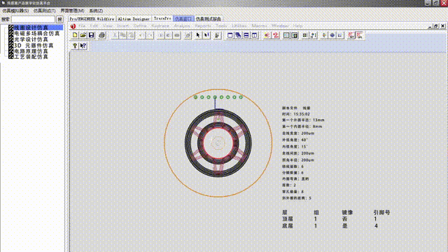
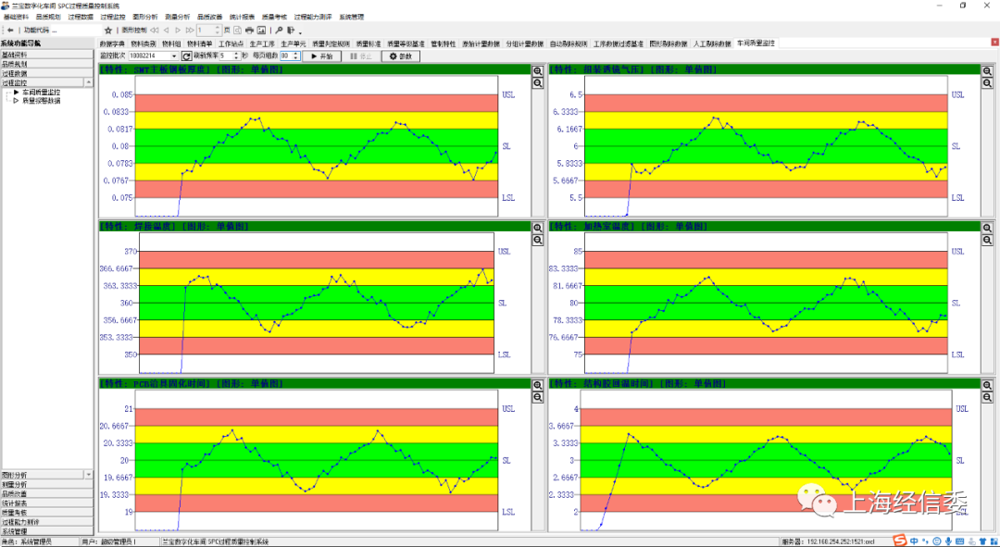

# 【智能工厂】上海兰宝智能传感器数字化智能工厂

**编者按**

智能制造是我国加快建设制造强国的主攻方向，是上海城市数字化转型的重要抓手。智能工厂是推动智能制造的切入点和突破口，是制造业数字化转型的重要载体。

2020年9月，市经济信息化委等6部门联合发布了《上海市建设100+智能工厂专项行动方案（2020-2022年）》，计划三年推动建设100家智能工厂，打造10家标杆性智能工厂，培育10家行业一流水平的智能制造系统集成商，搭建10个垂直行业工业互联网平台，即“10030”工程。12月，市经济信息化委认定授牌了首批20家上海市智能工厂，主要聚焦在汽车、电子信息、高端装备、生物医药等7个行业领域。为了总结和分享智能工厂建设经验，遵循“树典型、强引导、立标杆”的原则，我们分领域、分批次对20家智能工厂进行详细报道。

**一、项目简介**

图1兰宝智能制造传感器数字化智能工厂

上海兰宝传感科技股份有限公司智能传感器制造数字化智能工厂（以下简称，兰宝智能传感器数字化智能工厂）围绕三条自动化智能传感器生产线、三条模块化精密产品生产线、二十五组U型手工线，打通和整合现场数字资源，引入精益制造理论，利用边缘计算模型重新构建了数字化的传感器车间，应用Unity3D虚拟现实仿真技术对工厂布局和车间产线生产进行了1:1场景建模，按实际生产节拍设计了生产仿真系统。数字化工厂经过沙盘模拟推演，最终一次改造成功，在完成创新建设智能工厂的同时，确保生产提质增产降耗，取得良好的经济效益，为电子行业在智能制造数字化工厂应用积累了宝贵经验，树立行业新标杆。

**二、项目亮点**

兰宝智能传感器数字化车间通过虚拟化设计提高项目方案可行性、创新智能制造精益化理论、建设智能制造数字化基础平台、集成研发设计仿真平台、解决了生产质量的数字化问题。

通过智能制造创新解决关键问题、突破关键技术和短板装备，高质量完成核心装备、关键技术研究，确保智能制造工厂顺利建设。

**1.智能化设计：全流程虚拟化设计提高项目方案可行性**

图2兰宝U3D工厂建模仿真平台

图3兰宝生产仿真平台-业务流程仿真

图4兰宝生产仿真平台-生产节拍仿真

兰宝自主开发3D虚拟仿真平台，解决新厂车间产线布局设计、生产业务流程沙盘推演、生产实时监控等问题，对产线设计和改造进行3D建模，对业务流程优化进行沙盘推演，充分发挥虚拟现实技术在数字化工厂升级改造中的作用，减少产线改造现场试验次数，减少自动化物流系统业务测试部署次数，尽最大可能减少车间改造对生产任务的影响，提高数字化工厂项目升级改造一次通过率；在新产品开发中，可通过平台对新产品生产工艺流程进行详细仿真，为工艺设计和优化提供精准化的依据

**2.智能化产线：创新智能制造精益化理论改造产线**

图5兰宝精益制造业务蓝图设计

兰宝运用精益制造理论结合智能制造技术，重新设计了数字化工厂智能制造产线，对原来生产离散的工作岛模式、工位暂存半成品较多、产品柔性连接较多模块化较低、前道工序流转规划欠缺、产品中间流转信息纸质化的情况进行了深入改造。

图6兰宝数字化工厂产线AGV小车应用

兰宝提出了从生产现场出发进行经营改善为目标，充分利用“人、机器和IT协同”的柔性生产，减少贯穿全供应链、工程链的总成本，推动兰宝信息化数字化改造，提高产品价值的目的，完成传感器制造工厂整体改造评估、产线布局设计优化、设备与人员管理优化、质量追溯管理设计、自动化工位识别、产线信息化规划等。

**3.智能化管理：自研智能制造数字化基础平台打通所有设备数据**

图7兰宝智能制造数字化基础平台

兰宝智能制造项目团队自主研发了OPC中间层服务器，解决智能制造底层设备和信息化系统之间的数据鸿沟，使得生产现场所有设备数据无障碍采集至OPC服务器，实时发送给MES系统、ERP系统、APS系统、SPCD系统，为数字化工厂成功实施奠定坚实的基础。

**4.智能化研发：集成研发设计仿真平台提升研发效率**

图8兰宝Simulab设计仿真平台

图9电磁仿真设计

在兰宝研发中心已有的ANSYS、PROE、TracePro、ZEMAX、Altium Designer等仿真系统基础上进行研发设计仿真集成，统一仿真研发环境，使研发设计仿真工作成为信息化、数字化、高度集成化的平台，确保产品研发集中高效完成。

**5.智能化质量管理：解决生产质量的数字化管理问题**

图10兰宝SPCD质量控制系统

基于六西格玛质量管理理论搭建的SPCD生产过程质量管控系统，实现设备质量和工艺数据数字化，实现从SMT、组装调试、到灌封测试、高低温老化测试的质量检测监控，并在工厂控制中心完成现场生产质量监控和反馈，定期生成质量报表，配合质量管理部完成生产质量和工艺改进。

**三、项目成效**

兰宝智能传感器数字化智能工厂项目的建设正是两化融合在工业现场的具体实践，通过数字化工厂的建设，在基础的工业单元层面对信息化和工业化进行有机整合，实现了两化融合的科学发展。

数字化工厂实施后，生产单件产品平均工时缩短23%、产品研制平均周期缩短37.5%、综合能耗降低12%，同时完成企业标准3项、软件著作权6项、发明专利6项、智能装备6种。数字化工厂的建设取得了良好的经济效益，生产模式成果、核心装备成果具有行业可推广性。

兰宝智能传感器数字化智能工厂项目有效解决了离散制造业“多品种小批量”生产模式问题。运用3D仿真技术进行数字化建模设计和工厂布局仿真推演，并进行自动化产线改造和车间智能仓储系统、MES系统实施，集成了包括PDM产品数据库、Simulab设计仿真系统、SPCD车间过程质量控制系统、ECMS能源管控系统、DAC数据采集系统在内的信息化系统，实现了实时数据交互贯通、协同一致，构筑成为兰宝智能制造的强大核心。

---

欢迎转发，但请注明出处“上海经信委”

如何关注“上海经信委”？——点击右上角按钮“…”，查看官方账号，点击关注，了解上海最新产业发展和信息化建设最新情况
觉得不错请点赞！
**长按二维码关注我们**

