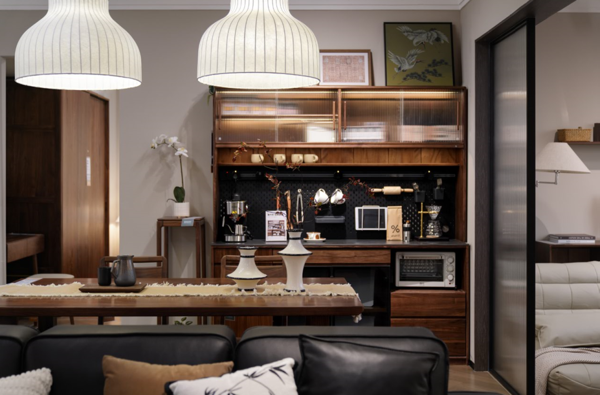
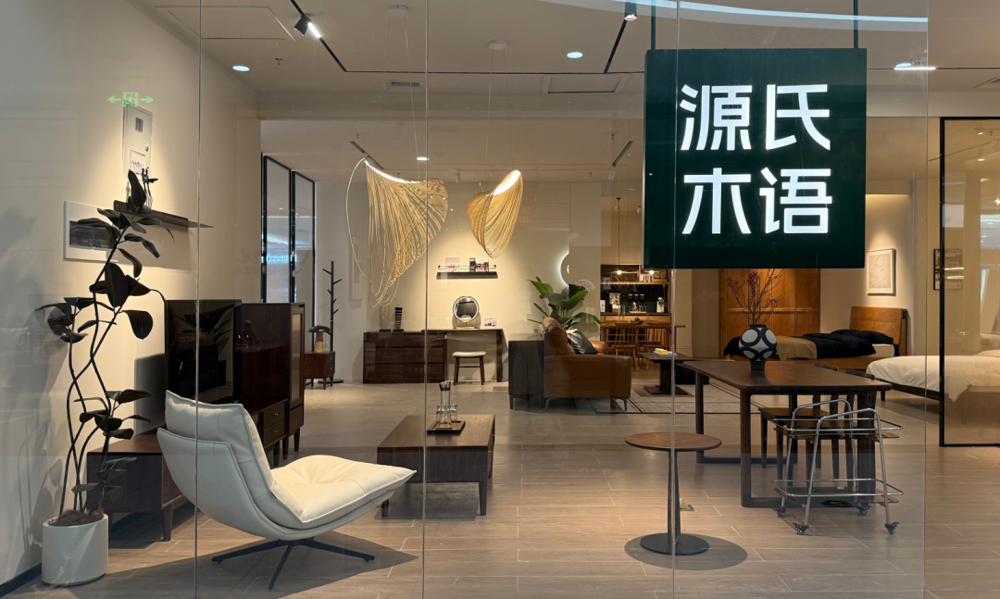
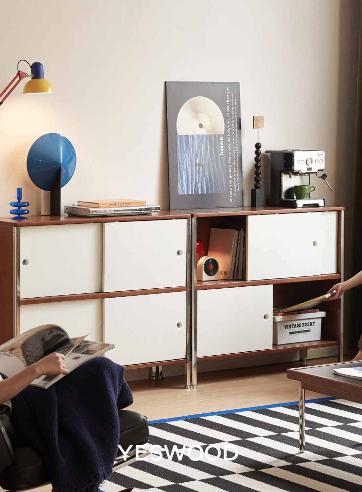
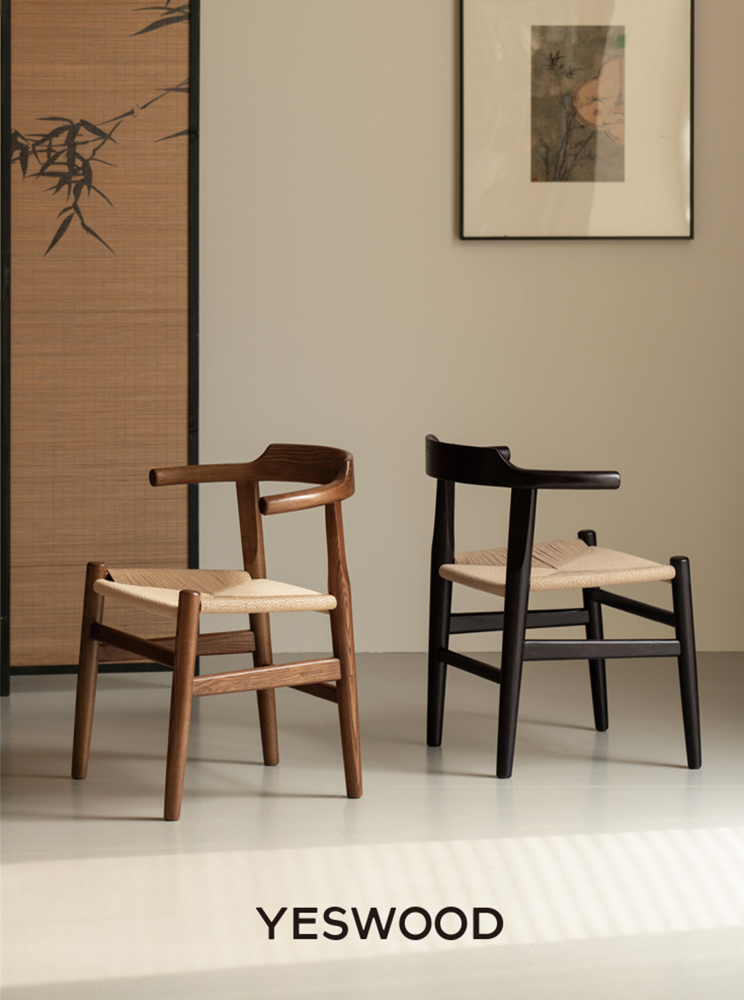
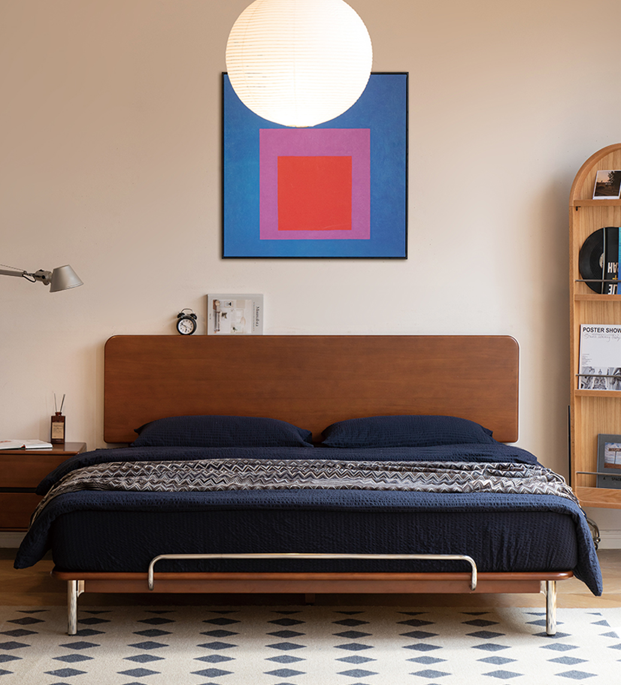
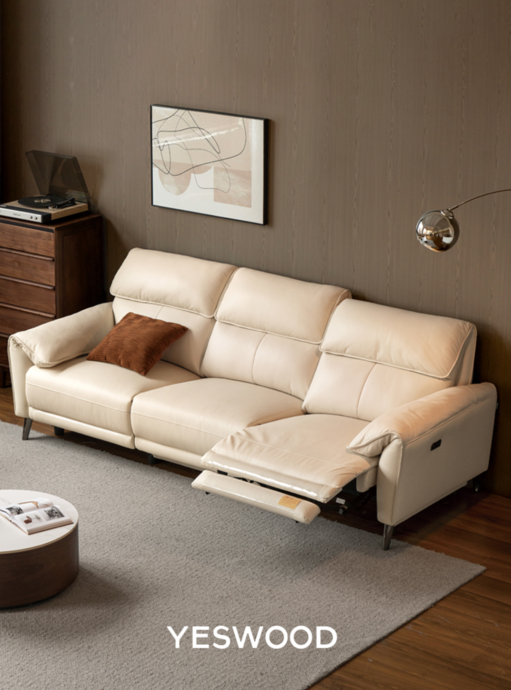
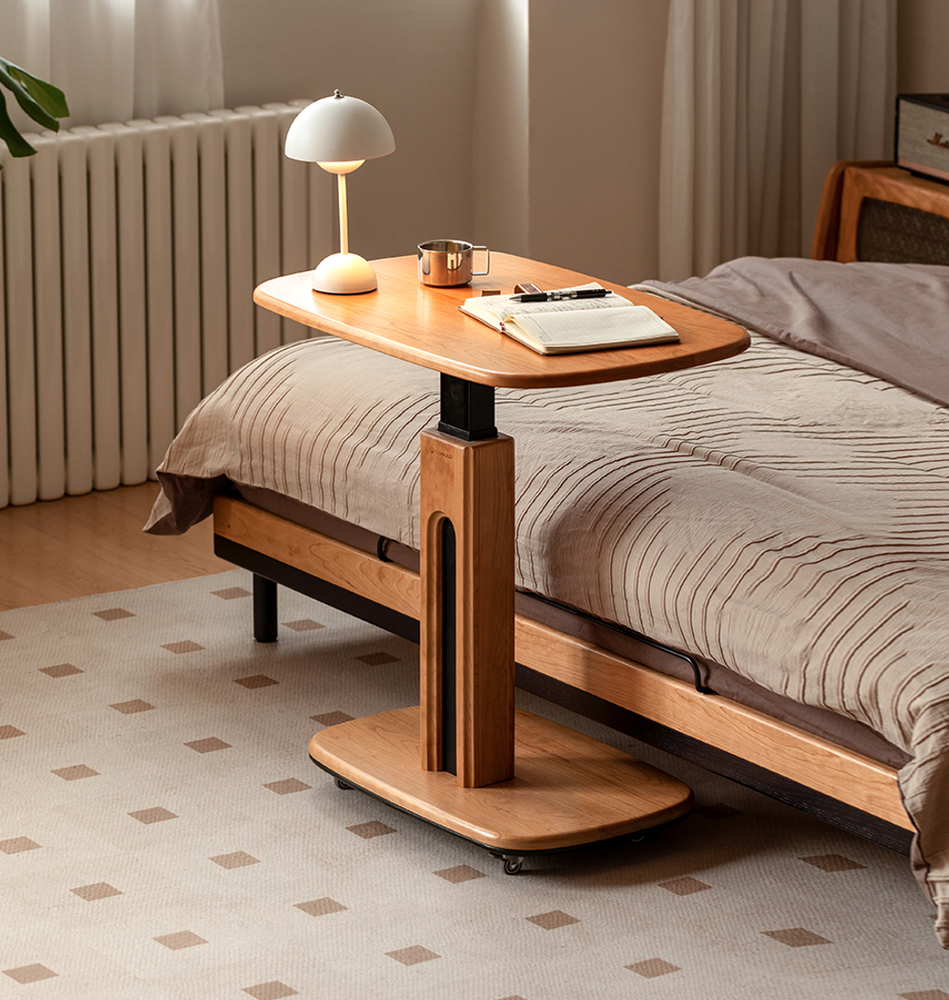
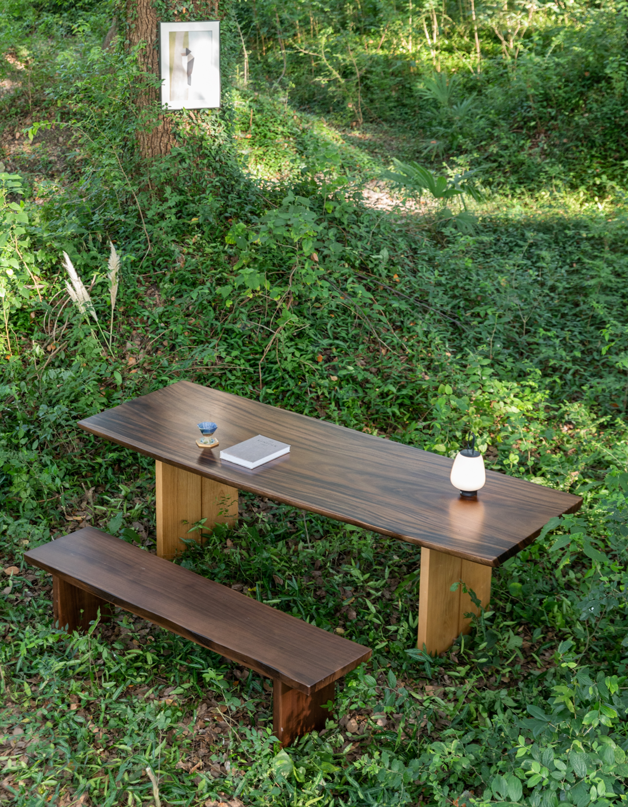
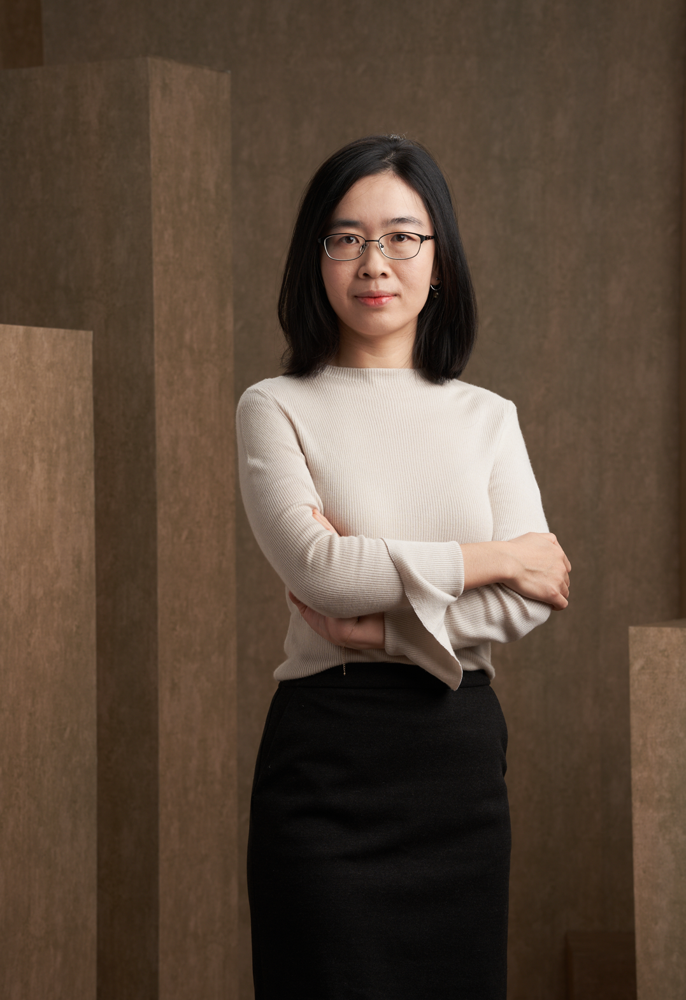
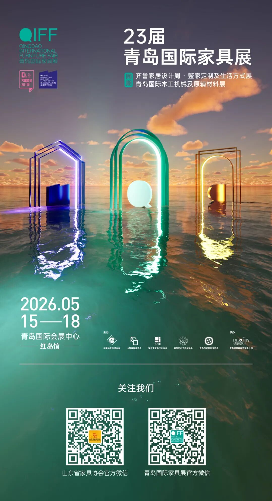

# 【资讯】2025年度中国全屋和定制家具十大品牌·源氏木语

已关注Follow  Replay    Share     Like  Close**观看更多**更多

*退出全屏**切换到竖屏全屏**退出全屏*山东省家具协会已关注Share Video，时长01:06

0/0

00:00/01:06 切换到横屏模式 继续播放进度条，百分之0[Play](javascript:;)00:00/01:0601:06[倍速](javascript:;)*全屏* 倍速播放中 [0.5倍](javascript:;)  [0.75倍](javascript:;)  [1.0倍](javascript:;)  [1.5倍](javascript:;)  [2.0倍](javascript:;)  [超清](javascript:;)  [流畅](javascript:;)  Your browser does not support video tags

继续观看

【资讯】2025年度中国全屋和定制家具十大品牌·源氏木语

观看更多转载,【资讯】2025年度中国全屋和定制家具十大品牌·源氏木语山东省家具协会已关注Share点赞WowAdded to Top Stories[Enter comment](javascript:;)  [Video Details](javascript:;) 

源氏木语成立于2010年，专注于实木家具赛道，集设计、生产、销售、服务于一体，致力于为消费者提供高品质的家居产品。

源氏木语围绕“实木+”现代家居，打造多达20+产品系列，如：真皮、布艺、藤编、岩板、亚克力等，涵盖全屋多个空间所有配置。倡导“新实木主义”概念，打破实木的刻板印象，提供年轻化的风格，多样化的新选择，包括：日式原木、奶油法式、文艺复古、新中式、黑白轻美式、樱桃木时尚理性风等等。顺应消费者对更高品质的追求，推出旗舰产品黑标2.0系列，选材用料上更加考究，0胶水床垫，采用超声波缝合技术，实现全垫0胶水，更环保更安心。

作为纯实木家具行业领跑者，源氏木语产品规模、体量、复购率均稳居前列。全网拥有超过2500万粉丝，并成为了阿里巴巴战略级合作伙伴、天猫百亿名品商家。

源氏木语不断夯实实木家具地位，拓展实木+领域，同时不断丰富产品品类（如真皮、床垫等等），走线上电商+线下新零售+海外协同发展的运营模式；实时洞悉消费者的生活方式，提供相应的产品及解决方案；全面提升质量和效率，实现降本增效。

2015年，源氏木语在上海开设了第一家新零售体验店。到目前，在全国已拥有超1300家门店，为全国近千万家庭提供优质的产品和服务。除了各大家居卖场，源氏木语还入驻龙湖、万达等核心购物中心，在多个核心城市开设旗舰店，让产品真正做到触手可及。

新零售高速生长的背后，有着一套完备的供应链支持。源氏木语是北美最大的硬木采购商之一，与全球12家大型木场建立深度合作，保证用材质量和价格稳定，并拥有接近200万平米生产制造车间、28万平米智能分拣仓储中心、和近4000项专利。在物流方面，源氏木语与多家物流公司建立深度合作，全国2000+城区免费送达，提供完善的物流、安装、售后服务，八年质保，终身保修，让消费者用得舒心、安心、放心。

源氏木语的愿景是成为中国大众首选的家具品牌，并具有长期可持续发展的生命力，以高品质的产品和服务，致力于为中国消费者提供有温度、舒适健康、可持续的生活方式。木之所及，皆美好。

实木创新者：新实木主义

新实木主义，是一场对家居本质的重新思考——“用天然木材的原始温度，承载当代生活的多元可能”。它既是对传统实木价值的坚守，更是对现代生活需求的革新回应：打破风格边界、重定义品质标准、重构功能逻辑，让每一件家具不仅是“木头的材质”，更是“生活的提案者”。

新时尚风格-包豪斯系列

新时尚风格-新中式

新时尚风格-中古风

新时尚风格：突破传统实木设计定式，结合不同木材特性、不同材质构建多元家居美学矩阵（中古风、轻美式、樱桃木时尚理性风、奶油风、轻奢风等），精准适配不同消费群体的审美偏好。

新品质高度：100%纯实木，环保涂装，黑标系列，0胶水床垫等，升级工艺定义品质新标准。

新百变功能-功能沙发

新百变功能-升降桌

新百变功能：创新随用户需求而进化，在基本款床基础上优化增加感应灯、双翼插座、升降桌、自由组合书柜等产品。

新自然形态-山野系列大板桌

新自然形态：诠释知木善用，木适万物，推出自然边大板桌等，展示实木自然新形态。

源氏木语品牌创始人张晔

Q：源氏木语的模式成为家居行业非常独特的标签。您认为源氏木语真正的核心竞争力是什么？

A：源氏木语的核心竞争力，可以概括为四个词：产品、质量、服务、价格，我们称之为品牌的内功。先要练就好内功：靠谱的质量，周到的服务，极具性价比的价格，相辅相成，正向循环；其次是爱惜自己的羽毛，获得消费者的信任，做到价值传递，才能做好品牌。

Q：源氏木语是如何从实木家居的赛道跑出，逐步成为“大众品牌”？

A：源氏木语从深耕实木家居赛道到迈向“大众品牌”，本质上是品牌战略与用户需求双轮驱动的结果。我们主要围绕三个维度实现突破：

第一，夯实实木领导地位，建立品类信任壁垒。

我们通过极致性价比和品质保障，在实木赛道建立了“高质不高价”的认知——从精选FAS级木材到环保涂装工艺，源氏木语赢得了消费者口碑。到2025年，我们的实木家具线上销量已连续十多年稳居实木家居第一，天猫家装618全周期品牌销售榜等十余个榜单TOP1，这为品牌大众化奠定了信任基础。

第二，以“实木+”战略打破边界，拓宽用户覆盖面。

早期我们聚焦纯实木家具，但为满足多元化需求，逐步深化“实木+”创新：例如实木与金属、岩板等材质的混搭设计，实木与智能家居的功能融合。近两年倡导的“新实木主义”，通过风格多元化、功能升级，吸引年轻、广泛的客群。

第三，全渠道布局，让品牌走进用户生活半径。

我们从纯电商起步，但意识到线下体验对家居决策有关键作用，因此加速推进新零售门店落地。门店选址从传统家居卖场，到购物中心、社区店，真正做到触手可及。目前全国门店已超1300家，真正实现从“垂直品牌”到“大众品牌”的渗透。

总结而言，成为大众品牌不是盲目扩张，而是“产品创新+渠道密度+心智占领”的三角均衡。源氏木语未来将继续以实木为内核，但用更包容的姿态拥抱多元需求，让“实木家居”从小众选择变成大众生活方式的自然表达。

Q：源氏木语近两年倡导“新实木主义”，什么是“新实木主义”？为何在当下提出“新实木主义”？这一理念希望解决消费者对实木家具的哪些痛点？

A：我们提出的“新实木主义”，核心是打破传统实木家具的固有边界。简单说，就是让实木从“风格固化”“款式功能单一”的标签里走出来，成为更适配当下生活的载体。

为什么现在提，因为市场和消费者变了。年轻消费者既认实木的环保质感，又不接受它款式单一；小户型家庭需要的是灵活适配的解决方案，而不是占空间的“摆设”。传统实木行业还在同质化的“原木风内卷”里打转，我们必须主动破局。

这一理念要解决的，正是消费者对实木的三大核心顾虑：其一，审美单一性—— 过去实木总被框在中式、原木风里，现在我们把中古风、包豪斯、轻美式等多元风格融入实木设计，让它能搭各种家居场景，颜值不再受限；其二，功能局限性——通过模块化设计（比如可组合的书柜）、功能细节升级（带感应夜灯和插座的床、齐边省空间的款式）、多功能产品（升降桌、变形沙发），让实木家具从“好看”变得“好用”，尤其适配小户型；其三，消费门槛——依托规模化采购和供应链优化，我们把优质实木的价格做到更大众，让年轻人不用为“实木”二字支付过高溢价。

说到底，“新实木主义”就是让实木回归生活本质：既保留它的天然优势，又用设计和技术消除使用痛点，最终成为普通人能轻松拥有的、兼具质感与实用性的家居选择。我们希望用天然木材的原始温度，承载当代生活的多元可能。

（来源：中国家具协会CNFA）

