# 学术丨巴蜀地区明代木构建筑研究价值及营造学社相关研究初探——兼论巴蜀地区明代木构建筑研究现状及展望

本文刊发于[《建筑史学刊》2022年第3期](http://mp.weixin.qq.com/s?__biz=Mzg4NTU1NTcyNw==&mid=2247499635&idx=1&sn=0f414aa7e70e75c04ad1b6a43c25ab37&chksm=cfa5a813f8d2210583307394161a31e4ea7f1e1330e0f2ffbf4453f3250ecb7a73879957d9bb&scene=21#wechat_redirect)

《巴蜀地区明代木构建筑研究价值及营造学社相关研究初探——兼论巴蜀地区明代木构建筑研究现状及展望》一文聚焦于巴蜀地区明代木构建筑研究的学术史，尤其着重回顾了营造学社对30余处明代木构建筑的研究，认为其奠定了巴蜀明代木构建筑研究的基础，文章同时指出巴蜀明代木构的特殊价值、研究现状以及有待开展的课题。

****巴蜀地区明代木构建筑研究价值********及********营造学社相关研究初探——********兼论巴蜀地区明代木构建筑研究现状及展望****

The Value of Ming-dynasty Timber-framed Architecture in Bashu Area and Related Research by the Yingzao Xueshe—Status and Prospects

冷婕 刘玉洁

LENG Jie, LIU Yujie

0 引言
在巴蜀传统建筑研究中，明代木构建筑在很长一段时间内并没有得到足够重视，缺乏系统而有深度的研究。导致这一现象的可能原因笔者认为有两点：一是曾有巴蜀地区清代以前木构遗存稀少的固有印象，认为巴蜀地区因多雨潮湿、加之明末张献忠屠蜀的大规模战乱导致清以前的木构建筑存留数量较少，保存质量差，研究对象缺乏；二是一定程度上受到曾经存在的、将明清建筑进行捆绑之观念的影响，误认为明代建筑与清代建筑做法大同小异，而忽视了明代木构建筑营造背景的特殊性及其营造的独特性，认为其研究价值不大。事实上，以上两点根本上均源于相当长的时间里对巴蜀明代建筑基础调研及价值认知的不足。
1 巴蜀地区明代木构建筑再认知及研究价值
1.1 巴蜀明代木构遗存的数量和质量均远超以往认知
早在20世纪30—40年代，中国营造学社（下称“中国营造学社”“营造学社”或“学社”）进行西南地区古建筑调查时就已发现元、明建筑30余处，但很长一段时间内，营造学社对西南地区元明建筑的调查并没有得到足够的关注，相关研究的跟进也比较少。近年来，随着文物部门普查、学术机构调研工作的开展，现已发现南宋建筑1座［江油云岩寺飞天藏殿，南宋淳熙八年（1181）］，元代木构10余座，而明代建筑则逾百座。现发现的遗存已远超出学社当年的调查范围，也大大超越了以往认知。
从近年调查来看，现存明代木构建筑地域分布广，四川西、北、南、东、中部地区均有案例遗存。实例年代从明早期洪武、永乐、宣德，直至正统、天顺、成化、弘治、嘉靖、万历。案例广泛的地域分布和较大的时间跨度，为全面了解这一时期木构技术发展的整体脉络提供了绝佳的条件。此外，现存明代木构建筑有超过半数的案例纪年较明确，主体大木构架的形制特征与纪年所处时代特征吻合度较高，使研究的可靠性和真实性得以保障。
1.2 巴蜀明代木构技术发展的时代独特性远超以往认知
因受少数民族统治，加之宋末长期抗蒙战争带来的人口、经济凋敝等状况，巴蜀地区元代大木营造在经济、社会条件的制约下谋求变化和表现，在接续南宋的基础上形成了更为灵活、变通的营造风格。但到明代，政治权力重新交归汉人手中，明朝政府对整个社会风尚的拨转对巴蜀地区大木营造产生了巨大影响，除部分延续元代做法外，巴蜀明代木构很快就紧跟官式营造风潮迅速朝规整、严谨的新方向转变，产生了不同于元代的、新的营造技术特征。
明末，巴蜀地区因社会动乱和张献忠屠蜀，城市和人口均遭遇重创。清初，“湖广填四川”的政策支持使大量南方移民进入四川，这一巴蜀历史上最大规模的移民活动也促使南方民间木构营建文化快速、集中地注入了巴蜀，且迅速占据主导地位，因此巴蜀清代大木营造无论在用材尺度、主体构架类型、斗栱施用、翼角、屋面做法上都显现了与明代的显著差别。正如刘致平先生所言“川中清式大木的转角出檐与明式迥然不同……一看翼角出檐的做法，便可断定哪个是明代的建筑，哪个是清代的建筑”。由此可见，与很多地区明清木构营造一脉相承、稳中渐变的情况不同，巴蜀地区明代木构营造技术与清代相比具有显著的时代差异，绝不能混为一谈。
1.3 巴蜀明代木构演变的多元性和复杂性远超以往认知
巴蜀地处中国西南，地理环境复杂、民族众多、文化多元，与其社会、自然环境变迁同步，其木构技术传播与演变的多元性和复杂性异常突出，这一点在明代木构中也表现得尤为显著。仅从现存遗构的初步研究来看，可发现明代木构中古老技术特征延续与时代营造风尚跟进共存，官方影响与民间技艺互融，南方与北方技术多向渗透，多民族文化技术交流碰撞，上述特点共同造就了异彩纷呈的巴蜀明代木构。
巴蜀内部呈现了既相互关联又具显著差异的技术分区。以成都为中心的川西地区木构营建中更多展现了与官方营造的紧密联系；川北地区建筑古朴，显现了与甘南、陕南地区较为相似的营造特征；川南地区建筑呈现出与云南地区及同处长江流域的川东地区的技术关联；川西、川西北、川西南地区聚集了大量少数民族，通过民族走廊的连接，几个民族地区中出现了相似的木构技术特征，同时在与汉地木构技术的碰撞和交锋中激发、创造出了新颖、独特的做法，现存巴蜀明代木构建筑中，斗栱营造最具特色的做法就出现在川西北和川西南两个少数民族地区。
建筑单体、群体中也不乏体现上述复杂性和丰富性的建筑精品（图1），如巴蜀地区现存最为完好，充分体现官式特征又巧妙融合民间做法的皇家敕建寺庙平武报恩寺；跨越元、明、清三代，且明早、中、晚期均有遗存的巴蜀木构技术演变活标本梓潼七曲山大庙建筑群；作为巴蜀地区明代斜栱、斜昂营造技术突出代表的川南屏山万寿寺、万寿观、宜宾旋螺殿；佛殿、壁画造像均保存完好且艺术价值突出的新津观音寺、剑阁觉苑寺；保存诸多古老木构营造特征的蓬溪鹫峰寺大雄宝殿、资中甘露寺；以及官式技术特征极为突出的安岳道林寺、遂宁灵泉寺大雄宝殿等。不仅优质的大木案例丰富，巴蜀地区还尚存一座精美绝伦的明代小木作，即平武报恩寺转轮藏，研究价值很高。
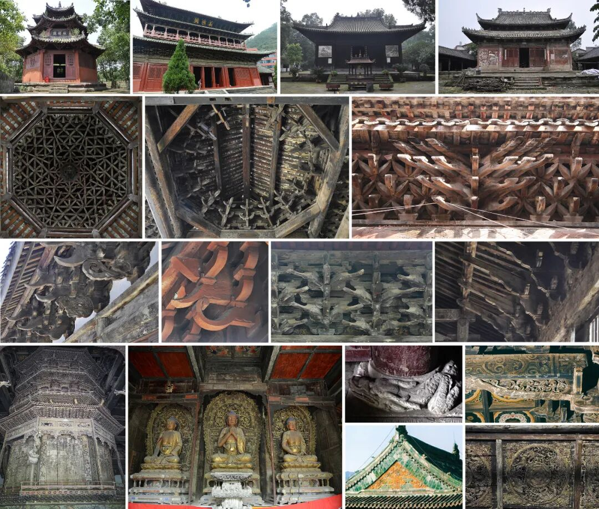图 1 部分巴蜀明代木构建筑一排：宜宾旋螺殿、平武报恩寺万佛阁、新津观音寺、资中甘露寺二排：旋螺殿顶层如意斗栱里转做法、屏山万寿寺观音殿室内承托铜镜斗栱、屏山万寿观前檐斗栱三排：荥经开善寺前檐斗栱、遂宁灵泉寺下檐斗栱、平武报恩寺万佛阁斗栱、安岳道林寺斗栱里转做法四排：平武报恩寺华严藏、剑阁觉苑寺佛像、平武报恩寺柱础、山花、彩画、荥经开善寺天花
1.4 巴蜀明代木构的研究价值
明代是整个巴蜀木构建筑发展史中具有突出特点的独特段落，其跨度近300年，发展演变异常复杂、多元，是巴蜀建筑史中不可缺失的一个重要部分，对其进行研究将是对巴蜀地区木构技术发展史展开的一次重要补充和完善，而明代内容的补足也将使巴蜀地区从南宋至清近千年的木构技术发展轨迹得以完整、连续地呈现。对于巴蜀建筑史研究而言这无疑是令人兴奋的，而目前丰富、高质量的遗存确为这一研究提供了绝佳条件。
自营造学社开始，建筑史学界逐步完成了对中国古代木构建筑发展总体规律的初步勾勒，但中国古代木构建筑发展的系统构建还远未完善、丰满，亟待对各地区木构建筑发展史进行深描和补充。巴蜀地区历史上就是国家西部安全防卫的战略重地，又是“民族走廊”“南北佛教”“经济传播”“长江流域”等众多要素汇集的重要节点，这些背景造就了巴蜀地区木构的复杂性和独特性，是整个中国木构发展史中不可或缺的一环，对其进行研究亦是对中国古代木构发展时空框架建立展开的重要补充和完善。
近10年，随着文物部门普查、学术机构调研工作的开展，巴蜀明代建筑的现状及价值逐渐被认知，越来越多的学者开始关注巴蜀明代建筑，为了更好地开展后续研究，笔者认为有必要对巴蜀地区明代木构建筑的研究历程进行一次系统梳理。
2 营造学社关于巴蜀明代木构建筑的调查研究概况、成果及学术成就
尽管日本学者伊东忠太在清代就对巴蜀地区古建筑、风土人情等进行过实地考察，但对巴蜀地区明代木构建筑更为全面的调查还始于中国营造学社。1937年，因抗日战争全面爆发，营造学社南迁，经历了武汉、长沙、昆明等地的转移，于1940年10月迁入四川宜宾李庄。在迁居云南与四川的时期里，营造学社曾多次对巴蜀地区古建筑进行调研，其中涉及大量的明代木构建筑，这些调研开启了巴蜀地区明代木构建筑研究的序幕。
2.1 涉及明代木构建筑的四次调研
2.1.1 川、康古建筑调查（1939年8月—1940年2月）
川、康古建筑调查是营造学社对巴蜀地区进行的第一次集中性调研，也是营造学社在西南地区进行的规模最大的一次调研。1939—1940年间，梁思成、刘敦桢带领研究助理陈明达、莫宗江对川、康地区开展了一次长达6个月的古建筑考察，这次考察从昆明出发经贵州到达重庆，后重点调查了重庆（南岸、江北、渝中区）、成都（市区、都江堰、青城山）、雅安、芦山、夹江、乐山、峨眉、彭山、绵阳、广元、苍溪、阆中（蓬安）、广安、南充、蓬溪县、遂宁县、潼南县、大足县、合川县、重庆、綦江、东溪等地。在此次考察过程中，营造学社调查和记录了近30处明代木构建筑，这也是巴蜀地区明代木构建筑调查和研究的开端。
2.1.2 西南古建筑调查（1940年7月—1941年12月）
1940年7月—1941年12月间，中央博物院筹备处与中国营造学社合作调查西南诸省古建筑与附属艺术，并准备制作模型和举办相关展览，这项工作营造学社方面由刘敦桢先生负责。尽管刘敦桢先生在《西南古建筑调查概况》一文中提到这一阶段调研涉及了四川重庆、成都二市的二十九个县和西康省雅安、芦山二县，但从各类文献记载综合来看，营造学社迁入李庄后面临研究经费异常短缺的状况，已无力外出开展大规模考察活动，因此文中提到的考察活动应为前次川康古建筑调查内容。但营造学社在迁入李庄后也在周边地区进行短期的小规模考察，其中李庄旋螺殿、宜宾真武山元祖殿等建筑应该就是在这一阶段调查中发现的，因为从上次的调研日记来看，当时并没有去宜宾。
2.1.3 广汉古建筑调查（1941年6月）
1941年6月，营造学社受邀前往广汉进行调研。当时的某政府官员想在其家乡四川广汉县重修县志，就请国立编译馆郑鹤声、康清先生到广汉成立修志调查委员会，并请营造学社帮他们拍摄一套完整的建筑影像资料。同年6月下旬，梁思成与刘致平两位先生赶赴广汉调查，后梁思成先生将《广汉县志·建筑卷》的编写任务交给刘致平先生完成。刘先生因此对广汉的城市规划布局、城垣、重要公共建筑、民居等作了系统调查，绘制了成套的图卷，内容非常丰富，但遗憾的是该成果并未发表就丢失了。营造学社在第一次调研中就去过广汉，当时调研了明代建筑龙居寺中殿，此次为营造学社对广汉进行的第二次调研。
2.1.4 宜宾李庄旋螺殿（1943年）
营造学社自西迁后研究条件就极其艰苦。1941年后，营造学社陷入了更为困难的时期，由于研究经费的短缺，这一时期大规模的田野调查已很难开展，因此学社成员就只能对邻近区域的古建筑进行更为细致的考察和记录。旋螺殿是营造学社在1940年10月迁入李庄后不久发现的。1943年，营造学社成员卢绳先生又受命对四川宜宾李庄旋螺殿进行了详细测绘，莫宗江、罗哲文两位先生与其同行，该测绘、调查工作共持续了两天。
2.2 已发表的研究成果
营造学社关于巴蜀地区明代木构建筑的部分调查成果后陆续出版，目前主要收录于以下书籍和期刊论文中（表1）。在四次调查中，学社成员共记录明代建筑30余处，初步判断了这些建筑的年代，拍摄了大批珍贵照片，对其中大部分建筑的木构技术特征进行了简述，并对其中的部分重要建筑作了较为详细的描述和测绘（表1，表2，图2）。本文对其进行梳理，以供后来学者参考、补充。
表1 包含巴蜀地区明代木构建筑的营造学社研究成果一览表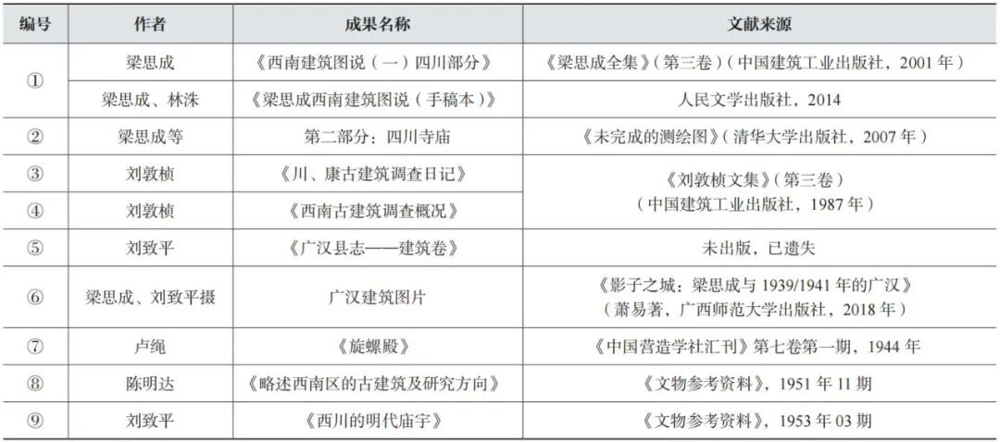注：编号①中两书的主要内容基本相同，故在此仅编一号。
表 2 营造学社巴蜀明代木构建筑单体建筑研究相关成果分析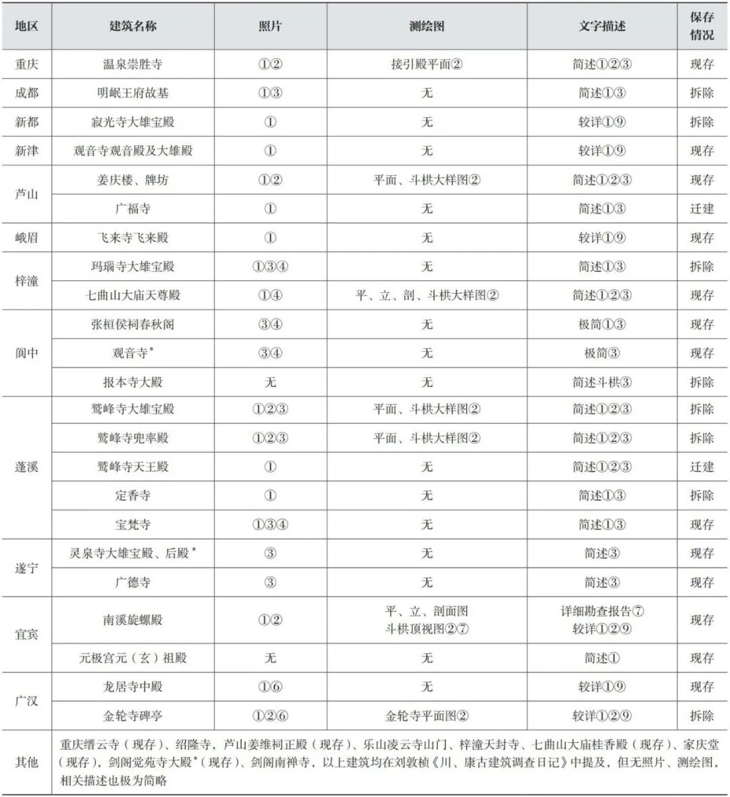注：1．名称后标有\*的建筑为营造学社认定为清代、现多认定为明代修建的建筑。2．每项叙述后括号中的数字代表出现了该项建筑信息的文献编号，此编号与表1中的文献编号对应。
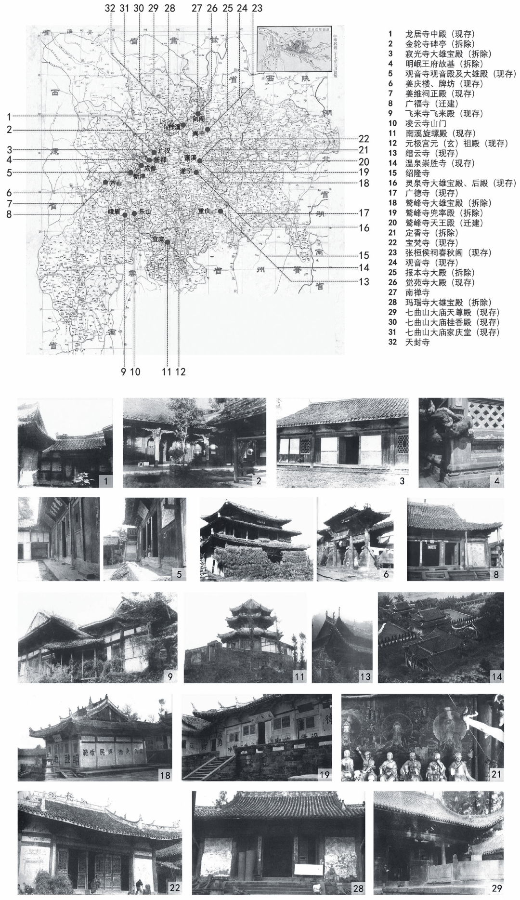图2 营造学社调研的巴蜀明代建筑
其实从营造学社成员的文章中可发现营造学社当时关于巴蜀明代建筑调查研究的资料应当不止已发表的部分，有些资料在后期可能不幸遗失，也还有资料有待后续公布。
2.3 学术贡献
2.3.1 营造学社留下的大量一手调查资料对当下的研究和遗产保护工作意义重大
营造学社在调查中发现了明代建筑30余处，在上述著述中学社成员对这些建筑的年代作出了初步判断，对其中重要木构的大木营造技术特征进行了描述，留下了大批珍贵照片，部分建筑还有测绘图（表2，图3），这些资料在今天看来显得格外珍贵。
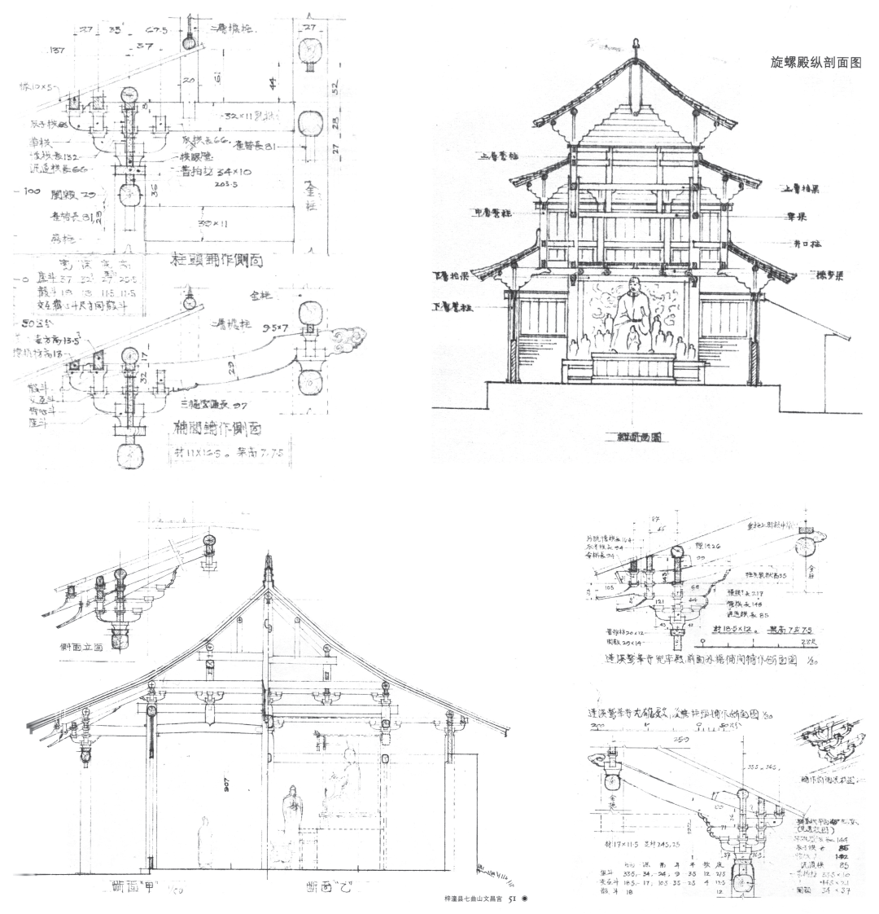图3 营造学社部分测绘图
首先，营造学社的调研资料将成为研究那些已消失建筑的重要途径，有些可能是唯一途径。从表2中可知，营造学社当年调研过的蓬溪鹫峰寺大雄宝殿、兜率殿、蓬溪定香寺、梓潼玛瑙寺大雄宝殿、新都寂光寺大雄宝殿等建筑现均已被拆除，因此这些建筑的信息就只能从以往保存的资料中获得。而被拆除的建筑中又包括部分极为重要的案例，如蓬溪鹫峰寺大雄宝殿，其歇山屋面分为两段式以及斗栱外出第二跳不出翘仅出横栱的做法在已知的明代建筑中均为孤例（图4，图5），这些特征就是营造学社在调研中发现并首次提出的，而鹫峰寺大雄宝殿的这种做法与四川汉阙和陶屋中的做法颇为相似。另外，笔者在研究巴蜀地区元、明木构斗栱的时候，原发现的最早出现斜昂的大木案例为正统年间的平武报恩寺，但查阅到营造学社的相关研究后才发现，斜昂早在宣德年间的新都寂光寺就已出现了（图6），这一资料的出现将斜昂在大木上出现的时间又提前了。笔者在进行巴蜀地区转轮藏斗栱研究时，曾在平武报恩寺华严藏中看到一种每跳均只出单向斜昂，且相邻两层出跳方向相反的独特做法（图7），笔者原以为这种奇特做法只会在小木作中出现，但阅读营造学社的调查日记时才发现，他们在重庆清代五福宫建筑的大木斗栱中也看到了该做法，并以文字记述，大大打破笔者的以往认知，同时引发了笔者对于小木作斗栱样式创新可能超前于大木的猜想。上述建筑都早被拆除，如果没有营造学社的资料，这些信息将无从获知。
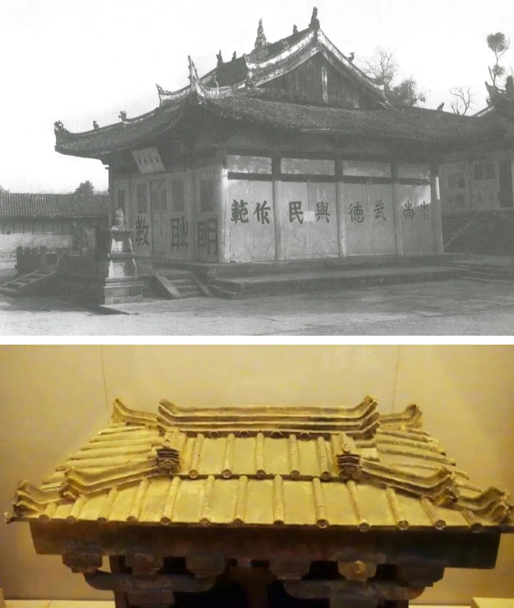图4 蓬溪鹫峰寺大雄宝殿和汉代陶屋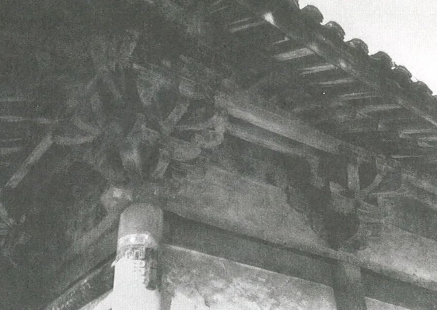图5 蓬溪鹫峰寺大雄宝殿柱头、转角铺作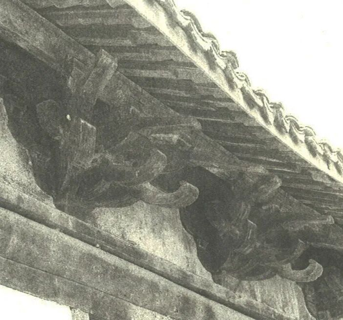图6 新都寂光寺大雄宝殿卷鼻斜昂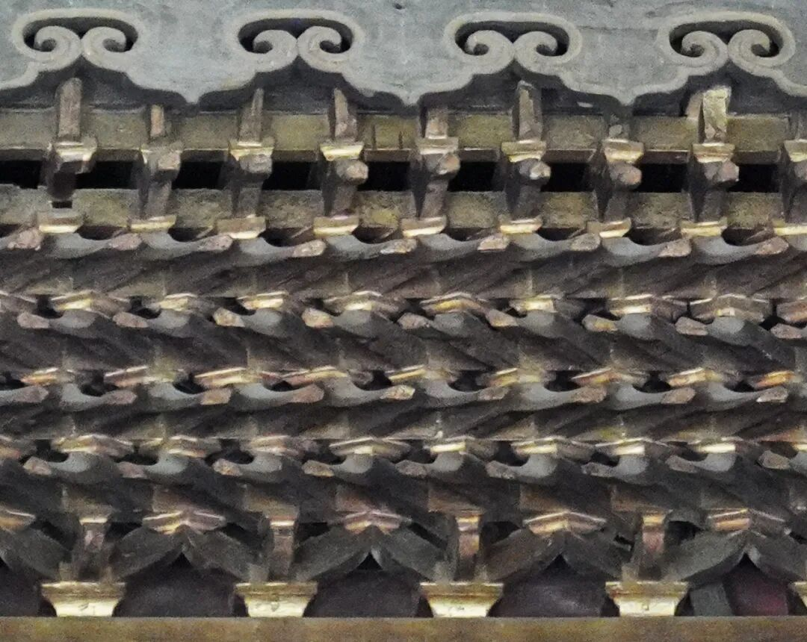图7 平武报恩寺华严藏天宫楼阁一层平坐斗栱单向出昂做法
对仍存留的建筑而言，营造学社的调查资料记录了其在抗日战争时期的历史状态，这为研究该建筑抗日战争后的变迁、探寻建筑原状皆提供了重要线索。2018年笔者与团队老师指导学生对四川宜宾李庄旋螺殿进行了测绘，其间发现其斗栱做法很不统一，有诸多改动迹象。但值得庆幸的是，学社成员在1943—1944年间对旋螺殿进行过调查和测绘，并在《中国营造学社汇刊》中刊发了极为详细的调查报告《旋螺殿》。正是通过这篇文章，确认了斗栱的大量改动是在1944年以后发生的，又通过与1944年《旋螺殿》中斗栱细节信息的比对和分析对旋螺殿斗栱原状进行了初步推断，这对认知旋螺殿的价值及后期保护、修复工作都尤为重要。再如芦山广福寺大殿，该建筑在营造学社的调查后又经历了迁建，其现状前檐明间两侧补间后尾连续出多跳，中间补间后尾挑斡长两步架的做法都颇存古风（图8），在现存建筑中均是少见的做法，可这些特征是否是迁建前的原状无法确认，直到读到学社调查报告后，通过与当时记载斗栱做法的对比才确认迁建后的建筑基本保持了原有技术特征。
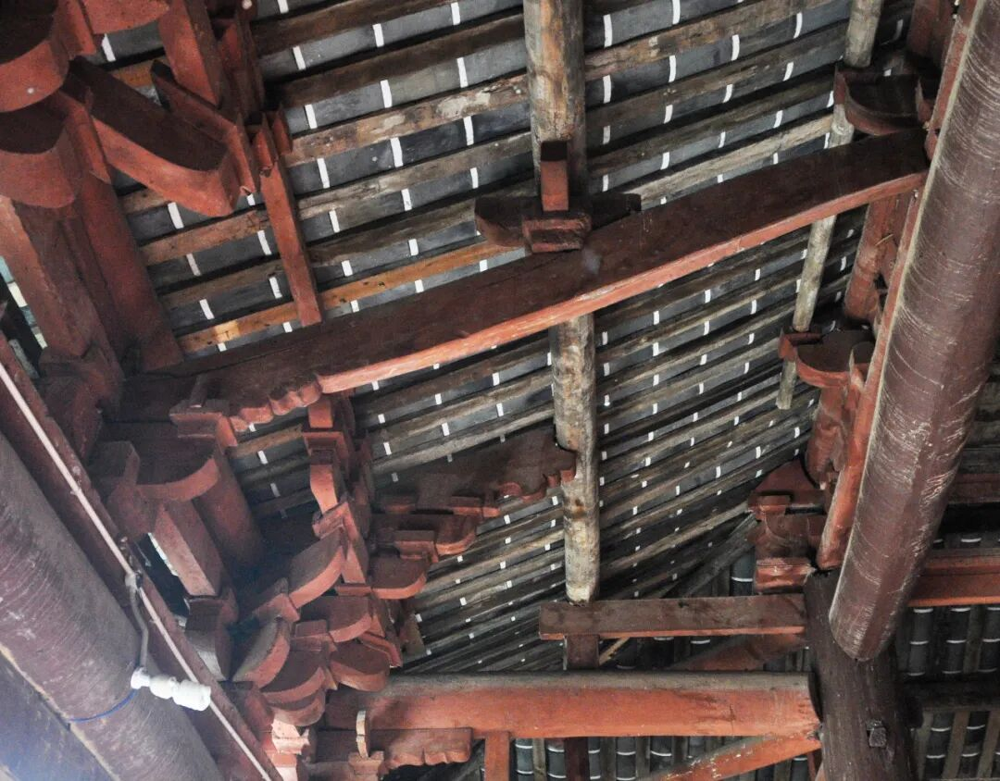图8 广福寺大殿前檐补间斗栱里转做法
再者，建筑上的部分历史信息在后期维修中被破坏，如佛像、碑刻、题记等，而营造学社的资料提供了相关线索和信息。如芦山姜庆楼在经过后期维修后，题记已不可见，但根据营造学社调查记述，1939年其正脊下有题记“维大明正统十年，岁次乙丑……”，且与楼下碑记信息吻合；上文所述芦山广福寺在搬迁后因更换构件原下金檩题记已不存，而根据营造学社当年的调查记载，原建筑下金檩下题有“明宣德三年建”字样。以上信息对后期判定建筑年代具有重要的参考价值。营造学社当年调研时，很多建筑中佛像及相关仪式用具尚存，而现今大量佛殿内除了建筑什么都没有留下。因此，学社的记录成为了解当时佛教建筑空间的为数不多的珍贵资料。
2.3.2 营造学社开启巴蜀地区明代木构建筑研究先河并为后续研究奠定基础
1．单体建筑特征分析
刘敦桢和梁思成两位先生的著作中提到了30余处明代建筑，对其中2/3建筑的建造年代、大木构架和斗栱特征进行了简述（表2）。其中，6座在刘致平先生《西川的明代庙宇》一文中有更为详细的记述（表2）。该文中除刘、梁二师已述内容外还补充了更多的营建背景信息，部分建筑的开间、进深，斗栱用材尺寸及细部特征。在所有单体研究成果中最为详实的还数卢绳先生的《旋螺殿》，文中对旋螺殿的营建历史、殿宇现状、梁架、斗栱、屋面、瓦石、装修、藻井的形制特征和尺度均进行了详细的记述和分析，同时还配有照片和全套测绘图（总图，平、立、剖面图，斗栱顶视图和透视图），卢绳先生的《旋螺殿》目前为止仍是关于旋螺殿最为全面和详实的调研报告。
2．总体营建特征及发展规律总结
对巴蜀地区明代木构建筑总体营造特征的总结主要集中在《西南古建筑调查概况》（刘敦桢，1942年）和《西川的明代庙宇》（刘致平，1953年）两篇文章中。两文均对巴蜀明代木构建筑的平面形状比例、梁架、墙体结构、外檐尺度及构件、斗栱形制特征等内容进行了初步总结。
（1）方形中殿 在平面形制中除了一般的长方形殿外，两位先生都关注到了巴蜀地区明代建筑中较有特色的三间方殿现象，刘致平先生在《西川的明代庙宇》一文中写道：“……正方形建筑在我国建筑上用的最早，在早年也最普遍。我们可以将它上溯到明堂及古代住宅穴居等建筑上去。不过今天所见则是长方形建筑最多，到处都是，而正方形殿反而稀少可贵，西川明代大量用正方形殿竟成为特色了……”
（2）北方官方建筑影响与典型民间做法 营造学社成员在研究中将巴蜀地区明构与北方官式建筑进行对比，总结了营造中的官方特征和民间做法。刘敦桢先生在《西南古建筑调查概况》一文中就提到巴蜀明代木构“梁架结构大抵与中原相类”；刘致平先生在《西川的明代庙宇》指出：“斗栱的各部分比例与明代北方官式做法很相近，……大木的翼角出檐做法，是子角梁与老角梁平，椽作翼角斜出状，亦是明代北方官式做法。……明代斗栱梁枋的彩画也常同北京明式的彩画制度一样，青绿如意箍头带红色花心。由此以上种种制度看来，我们可以断定西川明代庙宇的一切建筑都效仿北方……”
在关注官方影响的同时学社前辈也已注意到巴蜀地区明代木构中的典型民间做法。如在明早中期较为流行的檐柱升高、斗栱减跳现象，刘敦桢先生文中载：“……或山面与背面之柱，皆较正面提高一步，使额枋、平板枋成梯形递落者。揣其用意，殆欲藉檐柱之升高，可将此部之外檐斗栱省去一跳，以节省公料……”他将之总结为“殆为明以来川省木建筑特殊结构法之一”。此外，刘敦桢、刘致平在斗栱营造中还发现卷鼻昂、补间后尾多用挑斡、明中叶以后出现扶壁三重栱等民间营造特色。
（3）古制犹存 学社成员在调研中也关注到巴蜀明代木构中尚存古制的现象。刘敦桢先生指出：“……其大小额枋间，往往相距一、二尺，内施心柱一二处。又平板枋之断面薄且宽，均属较老之做法……”对于斗栱中补间后尾仍有长两步架做法者（图9），他指出此“为他处宋有之结构法”。刘致平先生在写到小木天花时指出：“殿内常在内槽用天花，天花板是方形，方块很大，也有时用小方格的天花，像宋式平闇做法。比较华贵的做法，则是在天花支条的两端，承以斗栱、蜀柱及荷叶墩等物，和宋式补间铺作很相像。这种做法是北方明清官式建筑所没有的……”
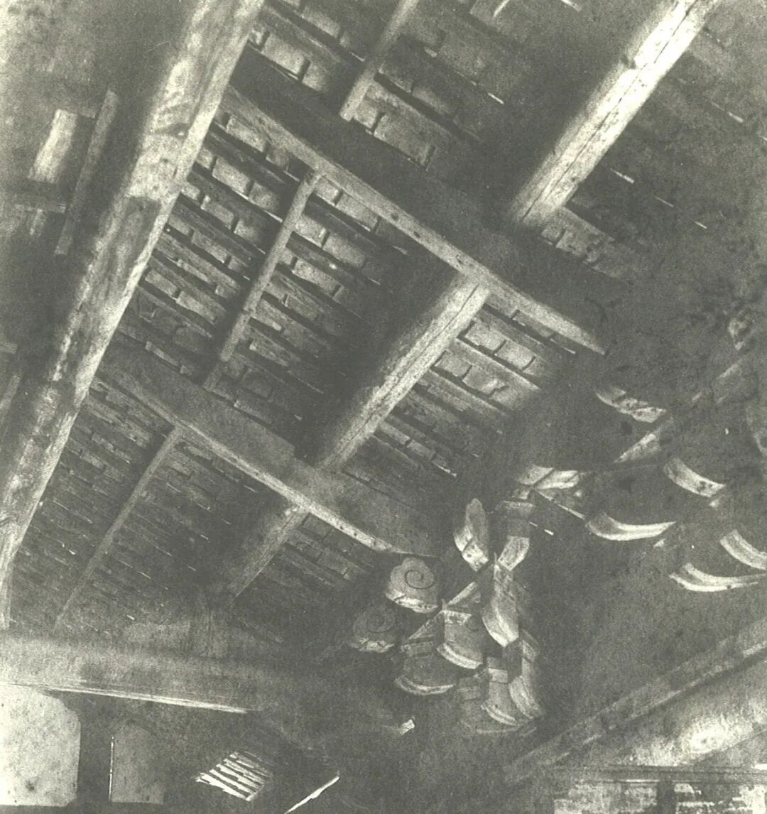图9 新都寂光寺大雄宝殿前檐补间里转做法
现在看来，尽管学社前辈当时对巴蜀明代木构的认知并不全面和完备，但不得不承认的是，他们已经非常敏锐地捕捉到了巴蜀明代木构建筑营造的很多关键特点，而这些特点仍是今天研究者起步的向导，其中的很多问题仍是现在被继续关注和深入讨论的重点问题。
2.3.3 营造学社对巴蜀地区明代木构价值认知的影响和对后续研究团体的带动
尽管营造学社西南古建筑调查研究，包括巴蜀明代木构建筑研究最早开始于受抗日战争的客观形势所迫，但这一偶然恰恰为中国建筑史的研究和系统建构打开了另一扇门。在此之前，营造学社的调查研究重点还更多地放在北方官式建筑上，从年代上看也更多集中在唐、宋、辽、金等古老的木构建筑中，当然这与建筑史处于研究早期及当时营造学社前辈肩负寻找中国最古老木构建筑的历史使命密不可分。但无论如何，转战西南的古建筑调查研究恰恰揭开了中国建筑历史研究的另一个宝藏，让学社及后来学者都认识到中国建筑历史的多面性和丰富性。它不仅在官方，也在民间；不仅在北方，也在其他地区；不仅在汉、唐或更为久远的遗存中，也在距离我们更近的时空中。这种观念的转变无疑对建立更为全面、系统的中国建筑史是有益的。而这种认知也从起初的偶然和无意识渐渐转变为后来的自觉。
营造学社对巴蜀地区明代木构建筑的价值认知也存在一个变化的过程。1939年，在营造学社川康古建筑调查开始前期，刘敦桢先生在日记中写道：“……故汉阙、崖墓、石刻三者，为此行之主要对象，但木建筑经张献忠入川后遗留几许，不无疑问，书此志疑，已竢后证。”而在调研过半之时，刘先生又写道：“截至本日为止，所调查之对象，以石制者占主要地位，即汉阙、汉崖墓，隋唐摩崖是已。木建筑则止于明，明以前者未曾发现，颇有美中不足之感焉。”由此可见，当时营造学社的关注重点还是更为久远的历史建筑，对明代木构并不很重视。而后来，改变慢慢发生，陈明达先生在1951年《略述西南区的古建筑及研究方向》一文中已明确提出：“……过去我们常把北方建筑认为是全中国的准绳，而忽视了北方建筑形式以外的建筑，例如西南区一些屋角几乎直立的翘起，这是北方所未见，我们应研究和了解它的原因……”他还指出对西南地区木构建筑的研究不能单纯求古，“由于西南地区气候潮湿，以木材为主要建筑材料的建筑物，不能长久保存，所以在西南区我们不能专以‘古’为研究对象，比较‘今’的也应加以注意。过去在西南区对古建筑的调查研究一般地存在着好古的观点，因为人们认为在北方有了唐代末年的建筑物，有许多辽代和北宋的建筑物，对四川境内存在的几处元代建筑和明代建筑就认为时代太晚，不屑查勘，这种态度是忽视了我们研究古建筑的目的是要了解它的演变规律和构成它的客观条件，而不是单纯求‘古’……”从这篇文章中，可以看出学社成员已经认识到北方以外的巴蜀地区建筑研究的价值，同时并不那么“久远”的元明木构建筑的研究价值也得到了肯定。1953年，刘致平先生发表了关于四川明代庙宇的重要论文《西川的明代庙宇》。
新中国成立后，重庆建筑工程学院建筑系及建筑理论及历史研究室重庆分室接续了营造学社在西南地区的部分研究内容。在20世纪50—60年代间，辜其一先生开展了关于摩崖的深入研究，同时还带领分室成员进行了四川南宋和元代木构建筑遗存的调查研究工作。辜其一先生是刘敦桢先生的学生，刘敦桢先生在《川、康古建筑调查日记》中曾多次提到他，只可惜分室关于巴蜀古建筑的调研资料已大部分遗失，成果仅见辜其一先生《江油云岩寺转轮藏》一文和少量照片。此外，当时重庆分室中的另一位重要学者叶启燊先生也是营造学社在李庄时招收的社员，与营造学社相关的经历应对其后期的学术研究产生了很大的影响。
3 营造学社之后的巴蜀地区明代木构建筑研究综述及研究展望
3.1 营造学社之后的巴蜀地区明代木构建筑研究
继营造学社的研究之后，巴蜀地区相继发现了南宋和元代木构建筑，从新中国成立到20世纪60年代末，巴蜀地区南宋和元代建筑的调查和研究工作陆续开展，而明代建筑的相关成果却依然只有上文提到的营造学社成员刘致平和刘敦桢两位先生的研究。70年代，因特殊的历史背景研究进入停滞阶段，到80年代才又恢复。
3.1.1 20世纪80年代—20世纪末
随着社会、文化各方面发展逐步回归正轨，古建筑的调查与保护工作得以大力开展，大量明代建筑在这一时期被发现，极大地推动了巴蜀明代建筑的研究。
这一时期巴蜀地区明代个案研究成果显著增加，但其中最多的是来自各地区文管所对辖区内明代建筑的简介。研究成果中也有不少对木构营建技术有较深入分析的论文，代表性论文有《平武报恩寺研究》（李志荣，1988年，重庆建筑工程学院硕士论文）、《剑阁觉苑寺大殿建筑及大木结构初探》（李显文，1986年）、《四川平武明报恩寺勘查报告》（向远木，1991年）、《绵阳市鱼泉寺》（孙华，1992年）、《深山名刹平武报恩寺》（李先逵，1994年），这些论文都为后续研究提供了较有价值的基础信息。另外，这一阶段较有代表性的成果还包括《四川古建筑》（四川省建设委员会等，1992年），该书以实地调查为基础梳理了四川地区较为重要的木构建筑，其中也包括重要的明代木构建筑。尽管这本书对建筑的描述多较简略，亦有不少疏漏，但每一建筑均附有图片，部分还有简单测绘图。此书记录了这些古建筑在20世纪90年代的状态，有重要的史料价值，同时也在很长时间内成为学者探访、研究巴蜀地区木构建筑的初步指南。
3.1.2 21世纪以来
21世纪以来，巴蜀地区明代木构建筑得到了越来越多的关注，特别是近10年，涌现了很多新成果。
一、随着深入普查的开展，关于巴蜀地区现存元明建筑的数量、分布情况的认知越来越清晰，这些基础信息目前主要收录于《中国文物地图集》（四川分册、重庆分册）中，《中国文物地图集》的出版为研究提供了重要的基础信息。
二、巴蜀明代建筑的测绘图逐步出版，平武报恩寺、荥经开善寺正殿、彭山梓潼宫、蓬溪宝梵寺、三台尊胜寺、遂宁广德寺碑亭、圣旨坊、三台蓝池庙岱岳殿、三台云台观、乐山市老霄顶万寿观、广汉龙居寺中殿、阆中张桓侯祠、南部观音庵、南部县真相寺等建筑测绘图的公开发表为后续定量研究提供了基础资料。
三、更为详实、研究视角更为多样的单体建筑、建筑群的调查报告和研究论文发表。这一时期的单体建筑研究总体而言较上一阶段更为细致、全面和深入，其中的代表性成果包括《平武报恩寺》（郭璇、戴秋思编著，2015年）、《四川古建筑调查报告集第一卷》（成都文物考古研究院编著，2020年）、《三台云台观》（四川省文物考古研究院、三台县文物保护管理所编，2020年）、《梓潼大庙建筑群研究》（高冬冬，2005年）、《成都市青白江区明教寺觉皇殿调查报告》（成都文物考古研究所，2011年）、《四川雅安市雨城区观音阁调查简报》（赵元祥、李林东、王亚龙，2019年）。近年出版的这些研究报告和论文在建筑年代的判断上更严谨、科学，对建筑原构形制的辨析更为细致和精准，这为后续开展系统研究提供了高质量的基础资料。
除了上述对单体建筑的年代、形制、尺度特征进行系统梳理外，部分学者还尝试对单体建筑中蕴含的古代工匠设计思维作出分析，展现明代木构的设计意匠，其中较有代表性的论文有《报恩寺万佛阁探微》（焦洋，2008年），《平武报恩寺碑亭大木结构设计浅析》（刘畅、郑凯竟，2014年），《试探四川宜宾李庄旋螺殿斗栱设计意图与原状——1944年〈旋螺殿〉与2018年旋螺殿的一次对比阅读》（冷婕等，2020年）等。
四、巴蜀明代建筑系统性研究再次开启。除营造学社刘致平和刘敦桢先生在早期进行了部分系统性研究外，在相当长的一段时间内，巴蜀地区明代建筑主要是个案研究，而系统性梳理较少，这主要还是源于基础研究的不足。2009年以后，随着基础研究的逐步积累，巴蜀明代建筑系统性研究的论文逐渐增多，有对巴蜀明代木构建筑发展特征初步进行总结的，有尝试对重庆地区现存明代木构建筑营造特征进行梳理的，有对四川地区明至清建筑结构和风格演变及原因进行初步分析的，还有以某一特征为切入点对其进行系统研究者，如对巴蜀明代木构中斗栱营造进行系统梳理和研究的，另有以滞后性作为切入点，对元明木构营造特点进行系统梳理的。
总体而言，近20年，特别是近10年，巴蜀地区明代建筑得到了越来越多的关注，研究成果越来越丰富，研究视角也越来越多样化。
3.2 巴蜀地区明代木构建筑的研究展望
巴蜀明代木构建筑研究已快速开展，但仍有很多方面亟待加强和补足。
3.2.1 深度的遗存辨析和个案研究亟待开展
尽管目前已有部分建筑测绘成果和相关研究报告出版，但已出版的建筑数量还不及巴蜀地区现存明代建筑总数的五分之一，大量价值很高的明代建筑的调查没有开展或成果未公布，因此，仍有大量的基础调查、测绘和研究工作亟待完成。
从现存建筑测绘图集的内容和质量来看，近年出版的调查报告在测绘精度、数据完整性、研究深度上均有质的飞跃，但总体而言这样扎实的基础调查报告还并不多，部分出版成果中仍存在明显错误。因此，目前仍急需更高质量的测绘和调查研究成果出版，深度的遗存辨析工作迫在眉睫，而这些是巴蜀地区明代木构建筑系统研究得以顺利开展的重要基础。
从单体研究成果来看，现有单体研究中对建筑的建造历史、原状形制辨析等工作的重视程度已显著提升，但仍有几个重要方面亟待加强。
1.材料与匠作
中国传统建筑的精华之一在于营造，因此不仅要看到其表面的样子，更需要将其拆解，了解其材料、性能及更深层次的建构逻辑和工艺，这相对于一般的形制描述难度大幅提升。从现有研究来看已有成果表现出了对这方面的关注，如《四川古建筑调查报告集第一卷》中对部分案例的木材树种进行了鉴定，在《四川雅安市雨城区观音阁调查简报》中作者通过对修缮过程的全记录对该殿的建构技术和工艺进行了研究。但总体而言，这一方向的研究还很薄弱，需大大增强。笔者认为，目前可以通过以下几种方式展开相关研究。一、细致的现场考察。这里所指的考察并不是短暂的、快速获取“主要”信息的考察，而是对研究对象长时间地、多次地、全面而系统地信息采集，以此深入理解整个建筑的形制与工艺。二、密切追踪文物修复项目，进行近距离观察和记录。三、通过大比例模型实作方式深入体察建构工艺。四、工匠访谈。
2．设计与意义
除了形制的认知外，需要更深入地了解古代工匠对于设计的思考及其源头。目前的研究还大多关注大木结构、构造等实体，缺乏对单体与环境，结构、空间与功能、行为，大木造型、结构、尺度与造像、壁画、小木作，形制、样式与意义等诸多关联性问题的深入研究，而这些内容将使巴蜀地区明代木构单体的研究上升到一个新的台阶。
从巴蜀地区现存的木构实例来看，这些研究是有条件展开的，巴蜀地区目前尚存部分格局较为完整的实例，部分殿宇中还完整保存了明代佛像、壁画、藻井、侧墙悬塑等，同时，相关的历史资料也非常丰富，大量历史文献中的信息尚待挖掘。
3.2.2 明代大木系统研究的推进
大木作发展的系统研究刚起步，尚存极大提升空间。系统研究需要在较高质量单体研究的基础上开展，前文已提到单体研究的步伐还需加快。同时，在单体研究尚未完全到位的情况下，系统研究也可以同步开展，但特别需要注意的是应对现有案例进行仔细甄别，使用未经过甄别的案例会造成错误结论，在这样的前提下，案例并非越多越好。
系统研究重点在于全方位梳理巴蜀明代大木作空间、时间的发展演变规律，同时加强对更广阔时间、地理空间维度的比较研究，寻求技术源头、发展传播轨迹、传播动因及途径。
从时间维度来看，尽管技术发展变化并没有明确的时间节点，不同结构、构件发展演变的轨迹也不一致，但在整体上仍存在有主流做法或营造风尚明显变化的情况。笔者在对弘治以前巴蜀明代木构斗栱营造考察的过程中就看到明显转变。在做这一研究时，较为重要的是要在大量基础比选筛查中找到敏感度高、形制工艺变化频繁的因子作为研究对象。
在区域影响和技术传播中，一方面巴蜀地区内分区域的研究还需要加强，从现存案例来看，巴蜀地区内部明代木构也存在明显的区域差异。另一方面，与外部区域的技术关联除周边临近地区的技术考察外，以下几个方面可以重点关注。
第一，官方主流营造思想在巴蜀地区的传播速度和影响力。营造学社在早期调查研究中就已发现巴蜀地区明代木构演进具有滞后性，也发现其与官式建筑的技术关联性。以往常认为，巴蜀地区地处偏远，中央官式营造技术传播到此应较为缓慢，影响力也比较小。但现有研究发现，官式营造技术在明初就随藩王制度的建立和藩王府的建设进入了巴蜀，甚至随着敕建进入了偏远的土司管辖地区。同时，除了直接的官方敕建活动外，官方营建的主导思想对巴蜀地区民间木构的总体营造方向也产生了明显影响，巴蜀地区明代木构营造的总体发展趋势与官方是基本保持一致的。研究中也需注意的是，官方影响在巴蜀各地区的影响力也存在显著差异。
第二，长江下中游地区与明代巴蜀可能存在的木构技术关联性尚未得到足够重视。因早期政治中心多位于陕西、河南一带，因此巴蜀明代及其更早期建筑的研究中对与北方木构遗存关联性的关注更多，但从明代木构遗存来看，巴蜀地区明代方三间的构架逻辑、鹰嘴蜀柱等细部特征都表现出了与江南地区更为相似的技术特征。事实上，行政中心的不断南移、长江水道的开发、移民政策的助推都可能使两地在更早的时间就产生了比想象中影响力更大的技术传播，这一点值得关注和深入研究。
第三，西部少数民族与汉式木构技术的交流与碰撞以往较少被关注。巴蜀地区是多民族聚居地，特别是在川西、川西北、川西南地区聚集了大量的少数民族，并在贸易、交通、宗教传播路线的基础上逐渐形成民族走廊，南向云南，北向甘肃、新疆等民族聚居地拓展。因此，在川西、川西北、川西南地区，不同民族的文化碰撞和交锋常激发出新颖、独特的做法。如现存明代木构建筑中，斗栱营造就表现出了强烈的地方色彩。在这一地区，就连官方敕建的寺庙也常常融合了民间做法。
在技术传播中，除却影响源、传播轨迹，更具难度的是透过现象寻求传播动因与途径，这需要从更广阔的政治、宗教、经济等视角出发，比如从官方技术在巴蜀地区的传播速度和深度不难看出明代巴蜀地区在国家整体管控中的战略重要性。在这一方面尚有太多值得深挖的内容。因为尚存案例数量多、内容庞杂，关于技术传播的研究中较易于入手的方式还是“以点带面”，已有研究中对“翼角”“斗栱”等切片的研究都属于上述方法。
3.2.3 其他
现存明代木构建筑主要为寺庙、道观、文庙等大型公共建筑的主要殿堂，这些建筑多为施用斗栱的官式建筑或民间大式建筑，目前的研究对象还主要为这一类建筑。对这些建筑的研究目前尚聚焦在大木技术上，但与其相关的小木作（转轮藏、藻井、佛龛）、彩画、瓦作、石作等也很有特色。小木作方面巴蜀明代转轮藏的研究近年较受关注，调查、研究也较深入，但其他方面营造的研究则还未开展或受到关注较少，特别是瓦作、石作、彩画等。巴蜀地区明代小木作遗存是否施用彩画及其彩画样式也是巴蜀地区明代与清代木构较为重要的区别点之一；且从现有研究来看，巴蜀地区明代瓦作及其与屋面结构交接与清代显著不同，因此上述研究都需要一步一步地开展下去。
此外，明代巴蜀地区还有更为广泛的民居及其他类型的小式建筑，包括寺庙、道观、文庙等在内的大型公共建筑中的次要建筑也多采用民间小式做法。小式做法常与大式做法显著区别，且从目前仅有的少量案例来看，其做法也与巴蜀清代小式建筑有明显差别。因此，探究明代小式做法既是全面认知巴蜀明代木构营造必不可少的环节，也可能是研究巴蜀地区明清木构营造文化传承与变迁很好的切入点，非常值得关注。但目前相关案例、史料和研究成果都很匮乏，亟待挖掘。

**作者简介**

冷婕，重庆大学建筑城规学院副教授，硕士，主要从事建筑历史与理论、建筑遗产保护研究。

刘玉洁，重庆大学建筑城规学院硕士研究生，主要从事建筑历史与理论研究。
