# 测评 | 定制衣柜选哪个品牌？深圳市消委会带您揭秘“柜”圈真相

如何在寸金寸土的住宅里

高效利用空间已成为每个家庭关注的问题

成品衣柜的收纳空间小、浪费空间、功能单一等缺陷已无法满足人们的需求

定制衣柜无疑是时尚家居的新宠儿

对于卧室这一特定室内环境，定制衣柜的质量更加受到人们的关注

面对市售的定制衣柜，消费者该如何选择呢？

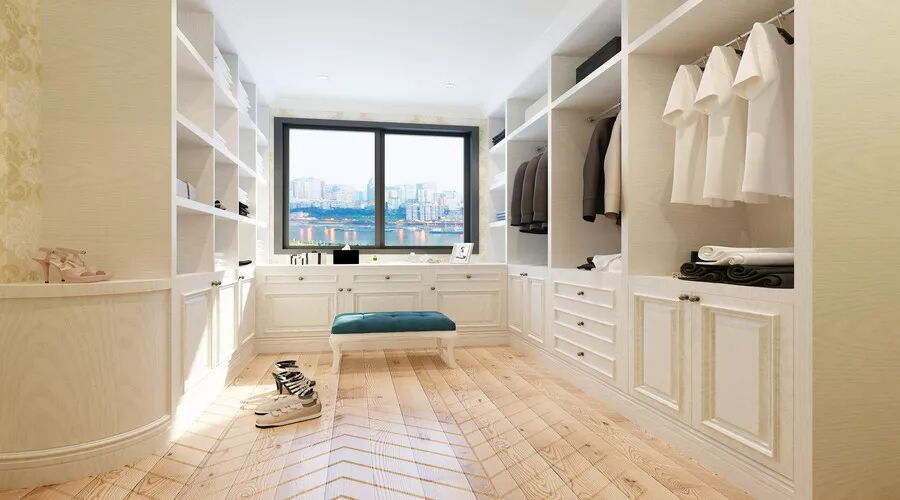

为此**深圳市消费者委员会**与**罗湖区消费者委员会、宝安区消费者委员会、福田区消费者委员会**共同委托**深圳市品质消费研究院**开展定制衣柜比较试验，对市售的定制衣柜样品进行比较测评。

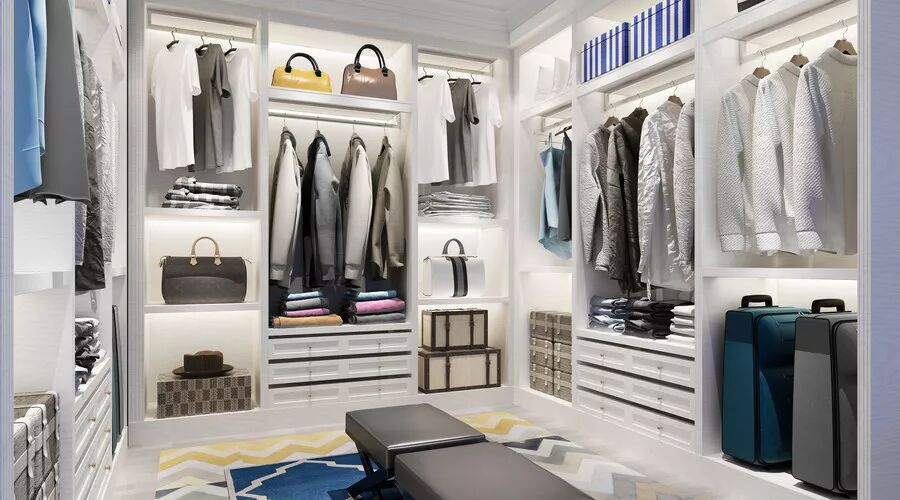

**本文速览**

◼本次比较试验五星产品有5款，四星产品有3款，两星产品有2款，警示产品有2款。

◼全部样品的有害物质释放量均符合标准要求，好莱客、百得胜、欧派综合表现最优。

◼材料质量方面，索菲亚、红苹果和尚品宅配得分最高，有5款样品部分指标不符合国家标准要求。

◼设计安装工艺水平方面，冠特、百得胜和梦幻家园等3款产品背板顶部裸露在外。

◼售后服务主观测评：冠特得分最高。

**Step 1**

**—   我们测了哪些品牌—**

本次比较试验样品共购买12款定制衣柜产品，涉及12个品牌：**冠特、尚品宅配、索菲亚、曲美、百得胜、梦幻家园、红苹果、科曼多、欧派、好莱客、顶固、史丹利。**

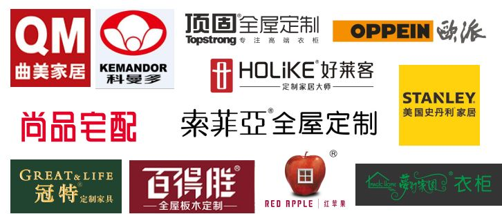

▲ 样品源于定制衣柜调查中消费者关注度高、销量好的定制衣柜品牌，均为工作人员在深圳本地卖场模拟消费者购买。

**Step 2**

**—  我们是怎检测的呢—**

测试共涉及有害物质及样品材料质量、设计安装工艺水平、售后服务和气味五大类的25个项目指标。

**定制衣柜比较试验测试项目总览**

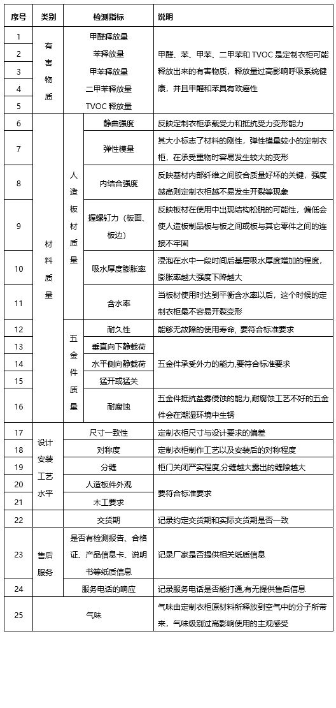

**Step 3**

**—  亮点集锦—**

**有害物质方面，全部样品的有害物质释放量均符合标准要求，好莱客、百得胜、欧派综合表现最优。**

本次比较试验中，有害物质共检测了甲醛、苯、甲苯、二甲苯和TVOC释放量等5项指标，综合反映定制衣柜释放到室内环境中的有害物质含量高低。

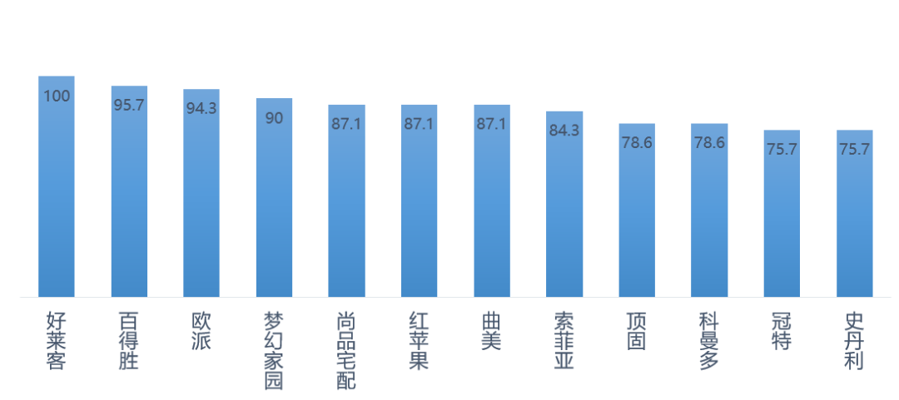

▲ 有毒有害物质综合得分情况

经检测，全部样品均符合深圳经济特区技术规范SZJG 52-2016《家具成品及原辅材料中有害物质限量》。

**有毒有害物质检测综合得分排名第一 👍👍👍**

**材料质量方面，索菲亚、红苹果和尚品宅配得分最高，有5款样品部分指标不符合国家标准要求。**

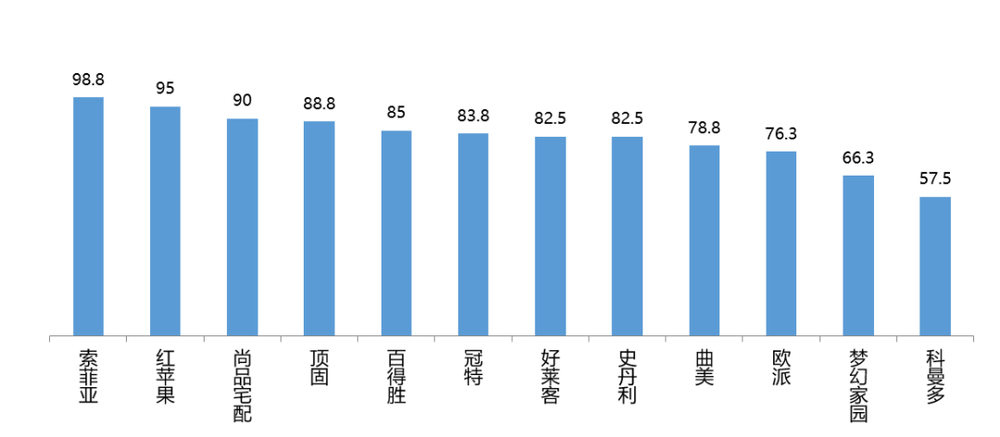

▲材料质量综合得分情况

材料质量分为人造板质量和五金件质量。

**材料质量综合得分前三甲 👍👍👍**

**【人造板质量】**

在内结合强度测试指标方面，科曼多样品的内结合强度为0.32MPa，梦幻家园样品的内结合强度为0.23MPa，未达到国家推荐性标准GB/T 15102-2006（≥0.35MPa）要求。

**【五金件质量】**

科曼多、史丹利和曲美五金件耐腐蚀测试未达到行业标准QB/T 2454-2013要求。

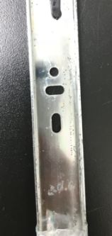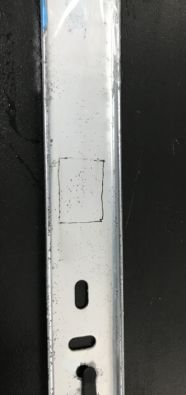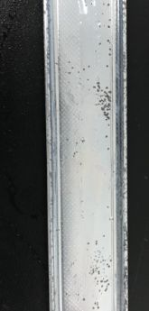

**设计安装工艺水平方面，冠特、百得胜和梦幻家园等3款产品背板顶部裸露在外。**

未封边的家具不但影响衣柜美观，而且长期暴露在空气中，易受潮而产生膨胀，造成板质疏松，影响使用寿命，还会造成有害物质的释放。

**售后服务主观测评：冠特得分最高**

本项目从交货期、纸质信息和电话服务响应进行考察。本项目得分最高的是冠特定制衣柜，约定交货期为24天，提前4天交货，约定和实际交货期均是在12款衣柜品牌里最短的，并且有提供合格证、产品信息卡和说明书。科曼多、好莱客、史丹利实际交货期均超出约定交货期，其中史丹利约定交货期40天，实际交货期为55天，消费者在购买时需综合考虑家装进场时间。

**主观测评结果显示，12款定制衣柜的异味均不明显。**

本项实验统一在定制衣柜安装好后8小时，由三名检验人员立即打开柜门，按照下表的评价标准进行评价。结果显示，12款定制衣柜的异味均不明显。

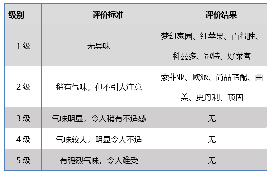

**Step 4**

**—****12款定制衣柜星级排行榜****—**

本次比较试验，五星产品有5款，四星产品有3款，两星产品有2款，警示产品有2款。具体如下：

**卓越**

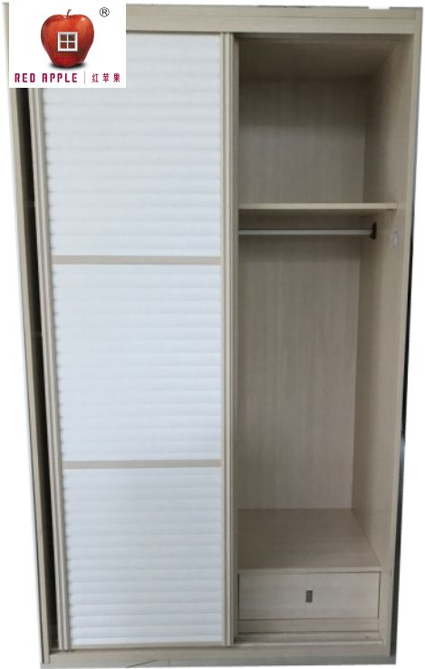

**品牌名称：红苹果**

**【测评结果】**

人造板+五金件质量、设计安装工艺水平，表现卓越；有害物质释放量、售后服务，表现优秀。

**【价格】**3420元

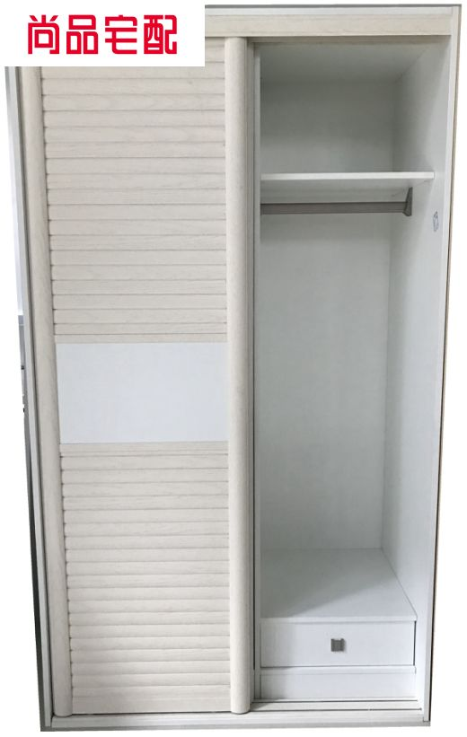

**品牌名称：尚品宅配**

**【测评结果】**

人造板+五金件质量、售后服务，表现卓越；有害物质释放量、设计安装工艺水平，表现优秀。

**【价格】**3645元

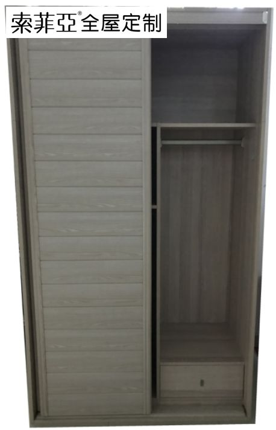

**品牌名称：索菲亚**

**【测评结果】**

人造板+五金件质量表现卓越；有害物质释放量、售后服务,表现优秀；设计安装工艺水平表现良好。

**【价格】**4029元

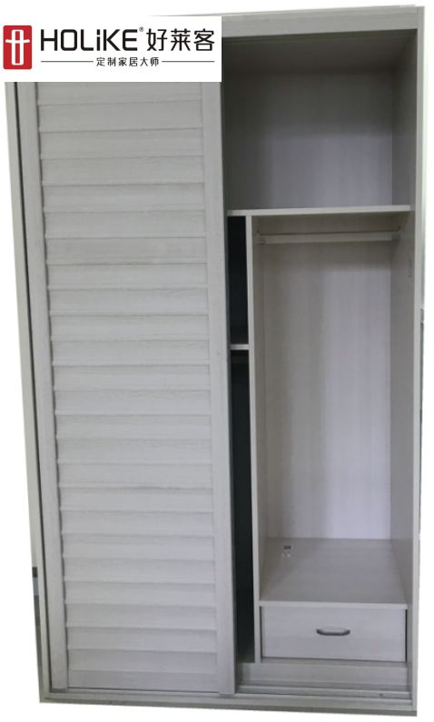

**品牌名称：好莱客**

**【测评结果】**

有害物质释放量、设计安装工艺水平，表现卓越；人造板+五金件质量、售后服务表现优秀 。

**【价格】**3917元

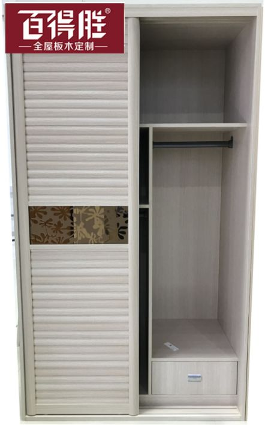

**品牌名称：百得胜**

**【测评结果】**

有害物质释放量、售后服务，表现卓越；人造板+五金件质量表现优秀;设计安装工艺水平，表现良好。

**【价格】**4750.2元

**优秀**

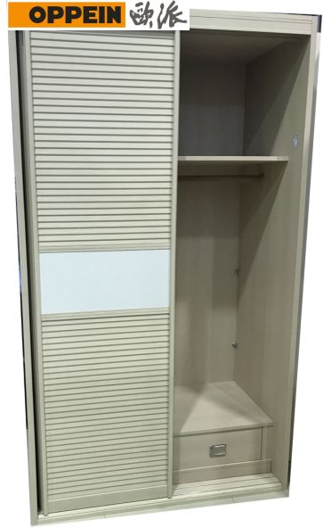

**品牌名称：欧派**

**【测评结果】**

有害物质释放量、售后服务，表现卓越；设计安装工艺水平表现优秀；人造板+五金件质量表现良好。

**【价格】**6760元

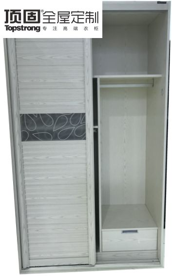

**品牌名称：顶固**

**【测评结果】**

设计安装工艺水平表现卓越；人造板+五金件质量、售后服务，均表现优秀；有害物质释放量表现良好。

**【价格】**6468元

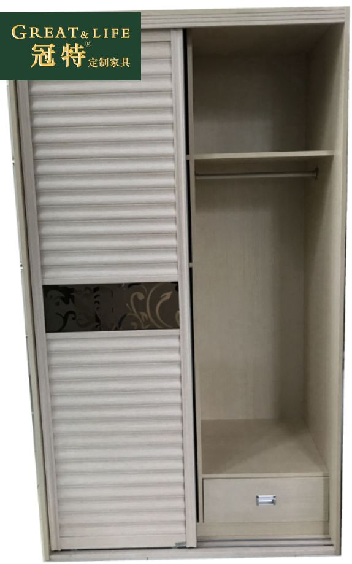

**品牌名称：冠特**

**【测评结果】**

售后服务表现卓越；人造板+五金件质量、设计安装工艺水平，均表现优秀；有害物质释放量表现良好。

**【价格】**3240元

**一般**

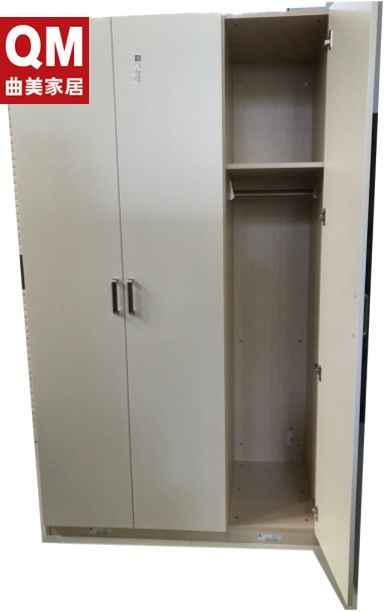

**品牌名称：曲美**

**【测评结果】**

有害物质释放量、设计安装工艺水平表现优秀；人造板质量、售后服务表现良好；**五金件耐腐蚀性差。**

**【价格】**4713元

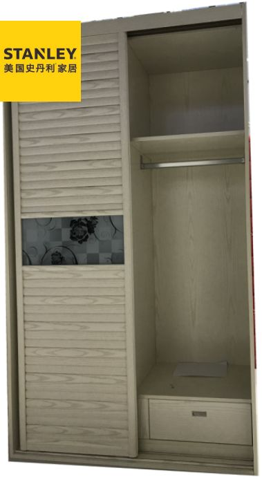

**品牌名称：史丹利**

**【测评结果】**

人造板质量、设计安装工艺水平表现优秀；有害物质释放量、售后服务表现良好；**五金件耐腐蚀性差。**

**【价格】**4900元

警示

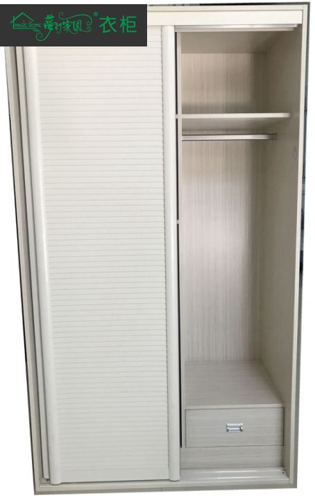

**品牌名称：梦幻家园**

**【测评结果】**

有害物质释放量表现卓越；设计安装工艺水平、售后服务表现优秀；**人造板质量（内结合强度）不达标，五金件耐腐蚀性表现一般。**

**【价格】**2468元

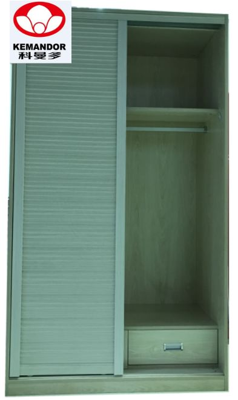

**品牌名称：科曼多**

**【测评结果】**

设计安装工艺水平表现卓越；有害物质释放量、售后服务表现一般；**人造板质量（内结合强度）不达标，五金件耐腐蚀性差。**

**【价格】**4148元

备注：

1.本次比较试验结果采用★表示，★越多，表示结果越好；最高为★★★★★。

2.价格为本会购买样品时的价格，仅供参考。

3.本次定制衣柜比较试验样品由市消委会模拟普通消费者从市内各大家居建材商场购买，统一提供样品图纸，样品尺寸皆为宽1.2米\*高2.1米\*深0.6米；其中11款样品为推拉门，曲美要求宽1.6米以上才能做推拉门，所以曲美衣柜样品为平开门。抽屉、挂衣及所有五金配件为厂家标配。根据实际情况，允许企业在上门测量后有细微调整。

4.本次比较试验结果仅对所调查抽取和购买的产品负责，不代表同品牌不同批次、不同规格产品的质量状况。

5.未经深圳市消费者委员会书面允许，任何单位和个人不得擅自使用本次比较试验结果作为商业宣传。

6.梦幻家园、科曼多因板材内结合强度未达到国家推荐性标准，不予评级，予以警示；曲美、史丹利各项指标综合评级为★★★，因五金件耐腐蚀性未达到行业标准，故总评降一级，为★★。

**消费小贴士**

**室内家具摆放密度不宜过高**

家具有害物质释放量符合标准要求，并不意味着室内环境的有害物质浓度低。室内环境的有害物质浓度，是室内摆放的所有家具和装饰材料所释放的有害物质叠加后的浓度，当室内家具摆放的数量过度，密度过高，即使每个家具的有害物质释放量不高，在室内同时释放的有害物质浓度总和仍是不容忽视。因此，消费者应全面考虑室内家具摆放的密度。

**注意保留定制家具的纸质材料**

消费者应注意保留合同、检测报告、合格证、产品信息卡和说明书，一旦在交货期、产品质量或其他方面发生纠纷时，有足够的纸质证据作为保障。

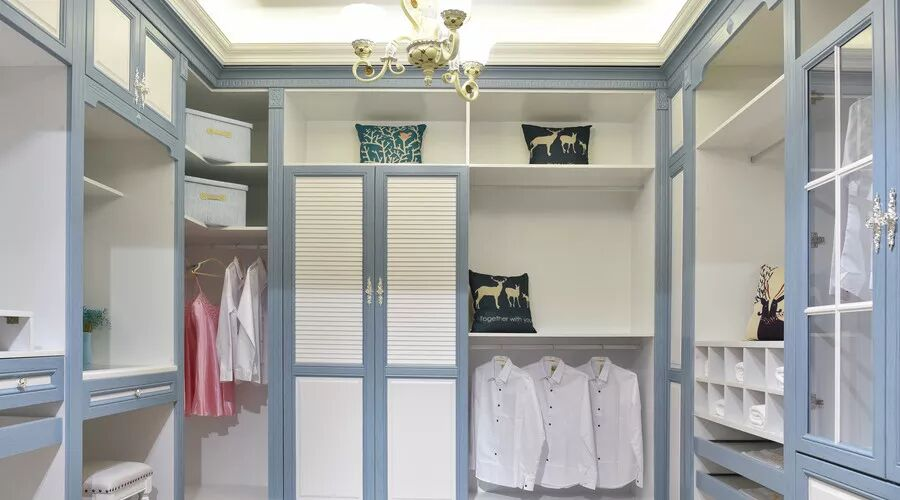

衣柜是卧室家具中不可缺少的一个重要元素

有了衣柜之后

我们的家居收纳就宽松了

家也就添加了色彩

而定制衣柜也是一门学问

大家get到干货小指南了吗？

欢迎给我们留言

 版权：深圳市消费者委员会

转载请注明出处

**深圳市消费者委员会**

**投诉热线：12315**
