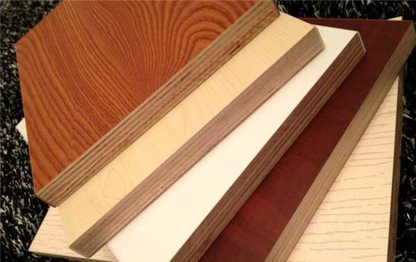
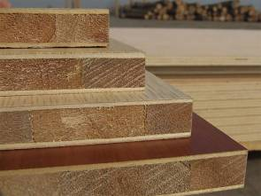
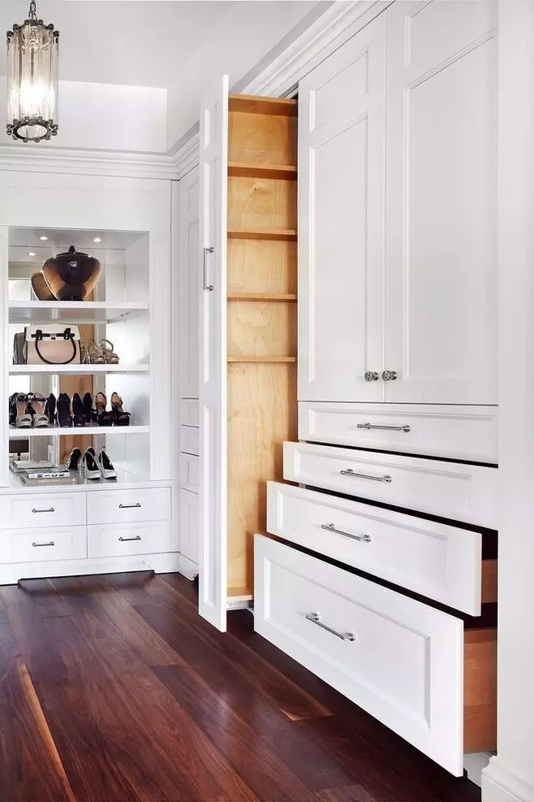
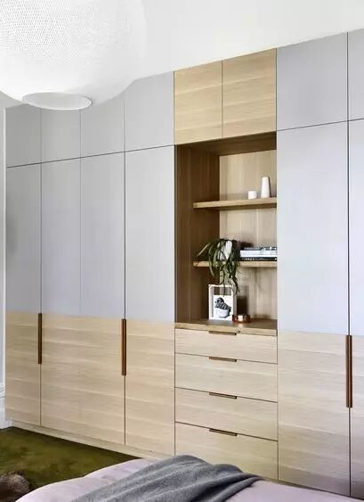
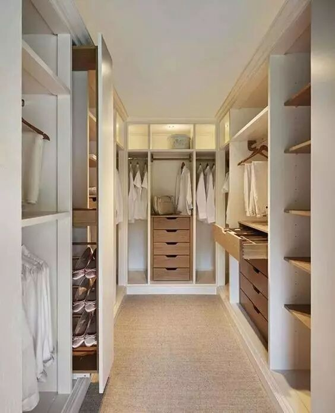

# 甲醛 | 多层实木板VS大芯板，定制衣柜用哪种好？

定制衣柜到底是用多层实木板还是大芯板好？今天房君就和大家说说多层实木板和大芯板的特点，大家可以参考哦~

▼

**多层实木板**

多层实木板是由三层或多层的单板或薄板经过木板胶贴高温高压制作而成，以纵横交错排列的多层胶合板为基材，表面以优质实木贴皮或科技木为面料，具有变形小、强度大、内在质量好、平整度好、具有自然真实木质的纹理及手感等特点，并且可以根据需求生产5-40㎜不同厚度的层板。

▼

**大芯板**

细木工板即我们俗话说的大芯板，是由两片单板中间胶压拼接木板而成。中间木板是由木板加工成一定规格的木条，由拼板机拼接而成。拼接后的木板两面各覆盖两层单板，再经过冷、热压机胶压后完成。大芯板尺寸稳定、不易变形，横向强度较高。

其实，消费者对于定制衣柜用什么板材关注得很简单，一个是环保，另一个就是在保证实用耐用的前提下，符合经济实惠的原则。所以，下面从环保、实用性能、价格三方面进行比较。

▼

**环保性**

**多层实木板**：虽然环保性与实木板不能相比，但是，经过高温高压、PVC四周封边，让甲醛的释放量达到国家的标准要求，大多能达到E1级。

**大芯****板**：有好差之分，经过国家等级标准的，环保系数都比较强。我们在选购时，一定要选择E1级的，不能因为价格退而求其次选择E2级，不然甲醛排放量会非常高。

▼

**实用性**

**多层实木板**：是用多层单板压制而成，所以结构稳定性非常好，不易变形，防水性和稳定性都非常的好。

**大芯板**：质量好的大芯板表面平整光滑，不易翘曲变形，具有强度高、含水率低的特点，但是比较怕潮湿，应避免用在厨卫。

▼

**价格**

**多层实木板**的强度主要跟板材的基层有关，每增加一层，其强度都会相应的增强，价格也会随之增加。

**大芯板**相较于刨花板等要贵，横向抗弯强度也要高很多。同一品牌，同一厚度的大芯板与多层实木板相比价格也比较低。

综上比较，建议如果预算比较充裕的话，可以选择多层实木板；如果预算稍低，可以选择大芯板，它的抗压程度也很强，但一定要选择质量好、环保性达到E1级的大芯板。

---

---

喜讯：

        即日起，泰陶卫浴新老用户和转发本信息者将你的房屋装修经验心得以文字或图片形式发送到（装饰经或东营泰陶卫浴）公众号，可以获得价值158元（免费)的室内空气质量（甲醛）检测一次。数量有限，先到先得，预约有效。微信电话：13561092850.

**推荐好号，精致生活**

长按二维码，选择“识别图中二维码”关注

> 东营泰陶卫浴
>
> ID：taitao0546-7296596
>
> 
>
> ▲长按二维码“识别”关注
>
> 东营泰陶卫浴为您提供家居产品选购及优惠资讯保养知识等信息.

> 装饰经
>
> ID：zhuangshijing123
>
> 
>
> ▲长按二维码“识别”关注
>
> 交流装饰经验，获取最新资讯
