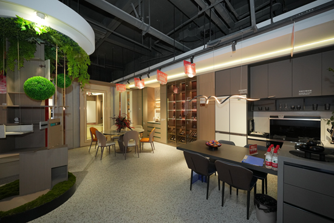
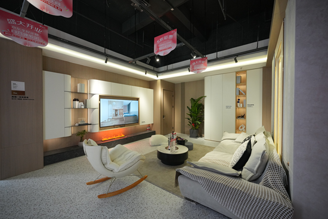
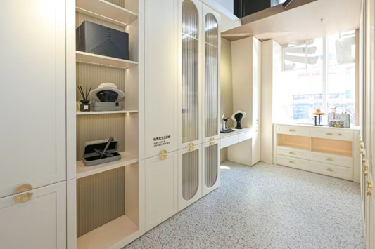
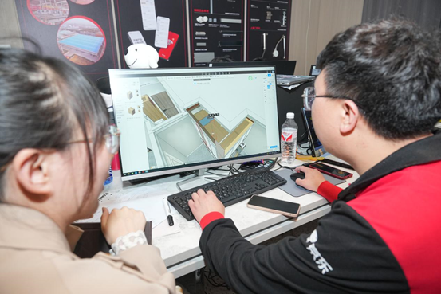
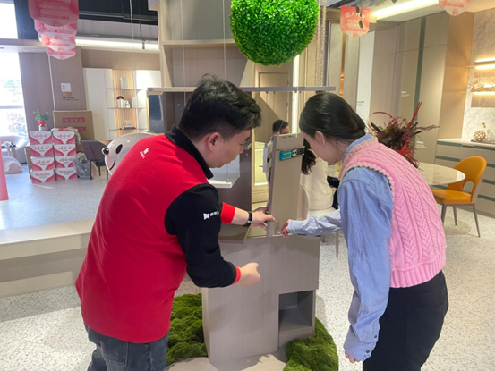
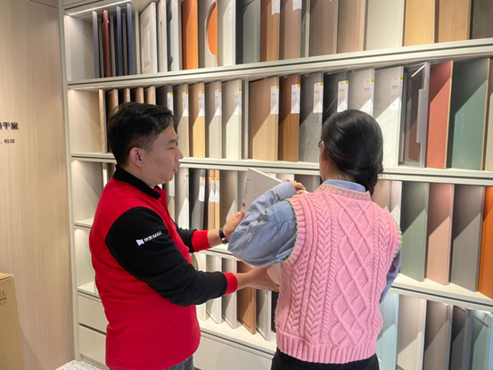
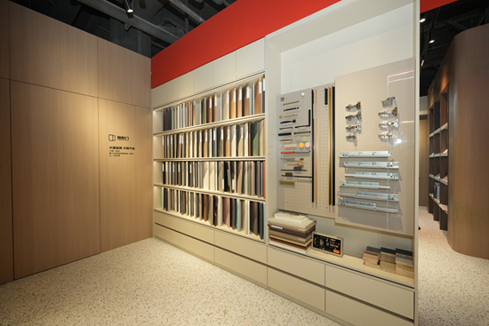
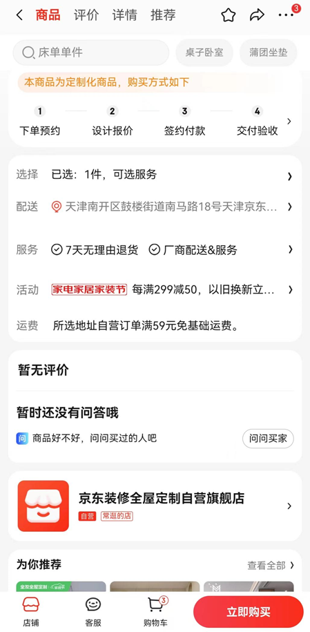

# 记者探访全国首家“京东全屋定制自营体验馆”

春暖花开，生机盎然。“春天装修季”开始，但也有一种说法：“装修是一种修行”……

前不久，全国首家“京东全屋定制自营体验馆”在天津京东mall开业。

已关注Follow  Replay    Share     Like  Close**观看更多**更多

*退出全屏**切换到竖屏全屏**退出全屏*天津广播已关注Share Video，时长00:30

0/0

00:00/00:30 切换到横屏模式 继续播放进度条，百分之0[Play](javascript:;)00:00/00:3000:30[倍速](javascript:;)*全屏* 倍速播放中 [0.5倍](javascript:;)  [0.75倍](javascript:;)  [1.0倍](javascript:;)  [1.5倍](javascript:;)  [2.0倍](javascript:;)  [超清](javascript:;)  [流畅](javascript:;)  Your browser does not support video tags

继续观看

记者探访全国首家“京东全屋定制自营体验馆”

观看更多转载,记者探访全国首家“京东全屋定制自营体验馆”天津广播已关注Share点赞WowAdded to Top Stories[Enter comment](javascript:;)  [Video Details](javascript:;)

京东推出全屋定制自营模式？价格合适吗？交付快不快？会有嘛套路吗？记者一探究竟。

200多平的门店内，被布置成不同的家居场景。客厅、卧室、厨房、衣帽间……每到一个场景，都能给人一种全新的家居体验。

穿插其中，是各类可供消费者选择的全屋定制板材、灯带、门板、五金等展示墙。

门店内，几位设计师正和来咨询的消费者沟通设计方案。“敦煌风、奶油风、古典风……”电脑上，VR展示的各类设计风格，让人看得停不下来。

“我在小红书上选的奶油风，我还爱囤东西，要好多储物柜……”90后市民小爽刚新婚蜜月回来，开始装修新买的二手房。翻着手机图片，跟设计师噼里啪啦地聊了起来。

之前，小爽逛了一些品牌的全屋定制店，但精打细算后，总感觉套路太多：“比如说这块其实不需要一个玻璃门，但是他就想让你去加一个，或者报价很虚，想达到理想的效果，就得另外加钱。”

抱着试试看的心态，小爽来到了京东全屋定制自营体验馆。透明的价格、京东APP可视化追踪进度、京东客服专业的服务……这些都让小爽眼前一亮。

以京东主推的22㎡全屋定制自营整家套餐为例，原价36800元，开业特惠期间不仅限时直降2万元，到手仅需16800元，还赠送价值16800元的升级礼包，包括背板厚度、五金等都可以免费升级。另外签约还赠送京东PLUS年卡、千元京东E卡，消费者装修完可以直接用于购买其它家电家居产品。

小爽在与设计师挑板材

京东在家电3C领域的业务一直有优势。“而随着用户消费习惯的改变，有些人从装修开始就已经考虑家电采购了，所以我们引进了这样的前置品类服务。”京东全屋定制自营业务相关负责人表示。

“在消费者最为关注的板材环保性、工艺安全性、五金质保等配置指标上，都实现了严格的品质把关。”比如，京东全屋定制整家套餐全柜体优选ENF环保实木颗粒板，更加环保，并将柜身隔板、背板、门板全部免费升级至18mm的厚度，更加防潮、防霉、更结实。京东自营的高标准，不仅确保了供货的高品质，而且在交付时效、售后服务上都更有保障，让消费者更加放心。

“上班摸鱼时，就能看安装进展。” 小爽笑着告诉记者。京东利用数字化技术优势，可以在京东APP为客户生成专属家档案，实现可视化追踪进度，“什么时候测量图、出效果图，定制生产、出库都在京东APP上能见到。”

京东APP上可追踪进度

看了一圈，小爽下了订单，忙着和设计师商量起设计图。

而像她这样的天津市民，只要在3月31日前到访体验店预约，或打开京东APP搜索“自营全屋定制”线上报名，就可以“享受免费全屋设计、免费上门量房、免费VR效果图”，以超值优惠价搞定全屋理想家。

**登陆京东app或网站**

**搜索****自营全屋定制****直达会场**

**开启家装新体验**

****

**- 京东自营全屋定制直达会场 -**

记者 | 刘克琦

